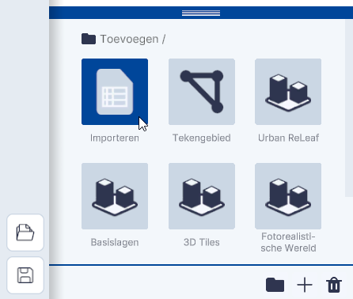
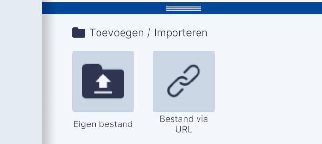
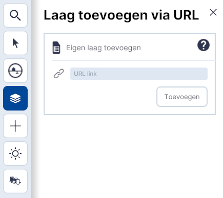
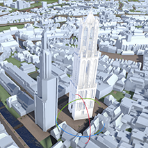
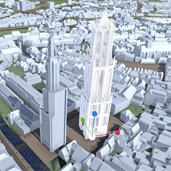
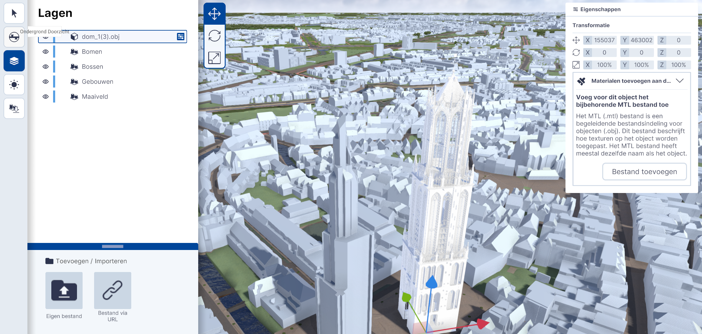

# Importeren

Functies, Lagen, submenu.  
  
  
_Toevoegen / Importeren_

## Gedetailleerde beschrijving van de functies

### **Importeren Eigen bestand**   

De functie `Importeren` biedt de mogelijkheid om **lagen en Objecten** via het importeren van bestanden of **via weblinks te koppelen**.
   
  
_Importeren Eigen bestand_  
  
Met `Eigen bestand` kunnen .OBJ, .CSV, .JSON, .GEOJSON en .GLB bestanden worden gekoppeld.  
Na klikken op `Eigen bestand` opent de Verkenner (Windows)/Finder (MacOs) en kan het bestand worden geladen.
    

!!!	tip "Drag and Drop"
	Met klik en slepen van een bestand vanuit verkenner of Finder in het viewervenster, worden bovenstaande formaten ook ingeladen. LET OP: Dit kan niet met meerdere bestanden tegelijk.

---

### **Importeren bestand via URL**   

  
_Importeren bestand via URL_  

Met **Importeren bestand via URL** kan je databronnen (WFS, WMS, GeoJSON, 3D-Tiles) via een weblink koppelen.  
Klik op `Bestand via URL`. Het menu; Laag toevoegen via URL wordt geopend.
   
 
 
Kopieër en plak de link van het bestand in het vakje [URL link].   
In de nabije toekomst is hier een link naar veelgebruikte WFS/WMS-lagen te vinden.

Na `Toevoegen` is de **link gekoppeld** en de **data zichtbaar** in de 3D-Viewer.  

---

## **Voorbeelden**   
### **Bestand Importeren met .OBJ**   

Stap1. Klik op `Eigen bestand` en importeer het .OBJ-bestand.
   
 
_Gedetailleerde Domtoren middels .OBJ geïmporteerd_  

Na het **importeren** wordt het **Object in de 3D omgeving** en in de lijst onder Lagen **zichtbaar**.  

!!! tip "Waarom heeft het geimporteerde Object niet de juiste afmetingen?"
	De viewer neemt automatisch de oriëntatie en schaal van het Object (3D-model) zoals het is gemaakt over. Met de transformatie-tools kunnen de schaal en/of oriëntatie van het Object worden aangepast. Het is ook mogelijk om de schaal van het Object en/of oriëntatie in een extern 3D-programma zoals Blender aan te passen en opnieuw te importeren.   

---
  
Stap 2a. Het geselecteerde Object kan met de **transformatie-tools** op de **juiste locatie** of aangepaste **oriëntatie en schaal** worden gebracht. Klik op het gekoppelde `Object` in Lagen en de transformatie-tool is geactiveerd.
    
{ width="248px" }
{ width="248px" }
{ width="248px" }  
_Verplaatsen, roteren en verschalen met de transformatie-tool_

---

Stap 2b. Met de `Eigenschappen` -functie kan de **locatie, oriëntatie en schaal** van het geimporteerde Object **handmatig worden ingevoerd**.  

_Handmatig invoeren van locatie, oriëntatie en schaal._ 
 
--- 
 
Stap 3. Met **Bestand toevoegen** kan het **.mtl-bestand** dat bij het .OBJ-bestand behoord **aan het 3D-model gekoppeld**. Hiermee wordt kleur- en textuur-informatie meegeladen met het 3D-model.  
Klik op `Bestand toevoegen` in het Eigenschappen-menu en selecteer het .mtl-bestand in de Verkenner/Finder.

---

### **Bestand bestand via URL**   
Klik op Bestand via URL en koppel de link.   
 

_Voorbeeld 1;  Luchtfoto's van Nederland gekoppeld met WMS-link_  

---

_Voorbeeld 2;  Landelijke BRT kaart gekoppeld met WMS-link_