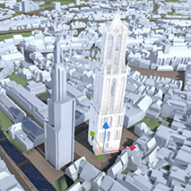

# Importeren

Functionaliteit, Lagen, submenu.  
  
{ width="350px" }  
_(Afbeelding) Toevoegen / Importeren_

---

## Gedetailleerde beschrijving van de functionaliteiten

### **Importeren Eigen bestand**   

De functionaliteit `Importeren` biedt de mogelijkheid om **lagen en objecten** via het importeren van bestanden of **via weblinks te koppelen**.
   
{ width="350px" }  
_(Afbeelding) Importeren Eigen bestand_  
  
Met `Eigen bestand` kunnen .obj, .csv en .js bestanden worden gekoppeld.  
Na klikken op `Eigen bestand` opent de Verkenner (Windows)/Finder (MacOs) en kan het bestand worden geladen.
    

---

### **Importeren bestand via URL**   

{ width="350px" }  
_(Afbeelding) Importeren bestand via URL_  

Met **Importeren bestand via URL** worden databronnen via een weblink gekoppeld.  
Klik op `Bestand via URL`. Het menu; Laag toevoegen via URL wordt geopend.
   
{ width="350px" }
 
Kopieër en plak de link van het bestand in het vakje [URL link].   
In de nabije toekomst is hier een link naar veelgebruikte WFS/WMS-lagen te vinden.

Na **Toevoegen** is de **link gekoppeld** en de **data zichtbaar** in de 3D-Viewer.  

---

## **Voorbeelden**   
### **Bestand Importeren met .OBJ**   

Stap1. Klik op `Eigen bestand` en importeer het .obj-bestand.
   
  
_(Afbeelding) Gedetailleerde Domtoren middels .obj geïmporteerd._  

Na het **importeren** wordt het **object in de 3D omgeving** en in de lijst onder Lagen **zichtbaar**.  

!!! tip "Waarom heeft het geimporteerde object niet de juiste afmetingen?"
	De viewer neemt automatisch de oriëntatie en schaal van het object (3D-model) zoals het is gemaakt over. Met de transformatie-tools kunnen de schaal en/of oriëntatie van het object worden aangepast. Het is ook mogelijk om de schaal van het object en/of oriëntatie in een extern 3D-programma zoals Blender aan te passen en opnieuw te importeren.   

---
  
Stap 2a. Het geselecteerde object kan met de **transformatie-tools** op de **juiste locatie** of aangepaste **oriëntatie en schaal** worden gebracht. Klik op het gekoppelde `object` in Lagen en de transformatie-tool is geactiveerd.
    
{ width="248px" }
{ width="248px" }
{ width="248px" }  
_(Afbeelding) Verplaatsen, roteren en verschalen met de transformatie-tool_

---

Stap 2b. Met de `Eigenschappen` -functie kan de **locatie, oriëntatie en schaal** van het geimporteerde object **handmatig worden ingevoerd**.  

_(Afbeelding) Handmatig invoeren van locatie, oriëntatie en schaal._ 
 
--- 
 
Stap 3. Met **Bestand toevoegen** kan het **.mtl-bestand** dat bij het .obj-bestand behoord **aan het 3D-model gekoppeld**. Hiermee wordt kleur- en textuur-informatie meegeladen met het 3D-model.  
Klik op `Bestand toevoegen` in het Eigenschappen-menu en selecteer het .mtl-bestand in de Verkenner/Finder.

---

### **Bestand bestand via URL**   
Klik op Bestand via URL en koppel de link.   
 

_(Afbeelding) Voorbeeld 1;  Luchtfoto's van Nederland gekoppeld met WMS-link_  

---

_(Afbeelding) Voorbeeld 2;  Vakantie statistieken van het CBS gekoppeld met WMS-link_