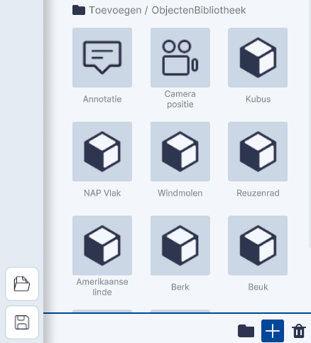
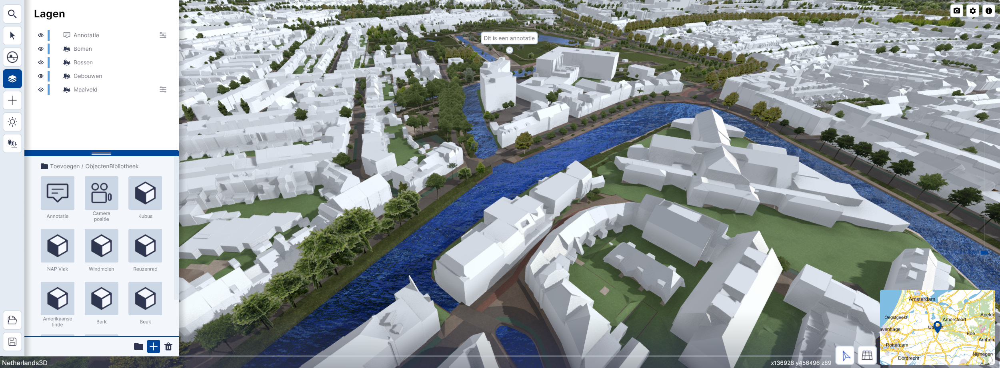
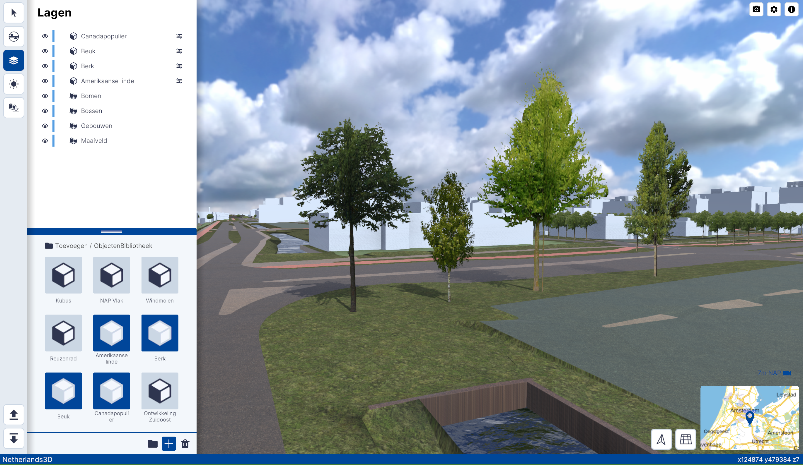
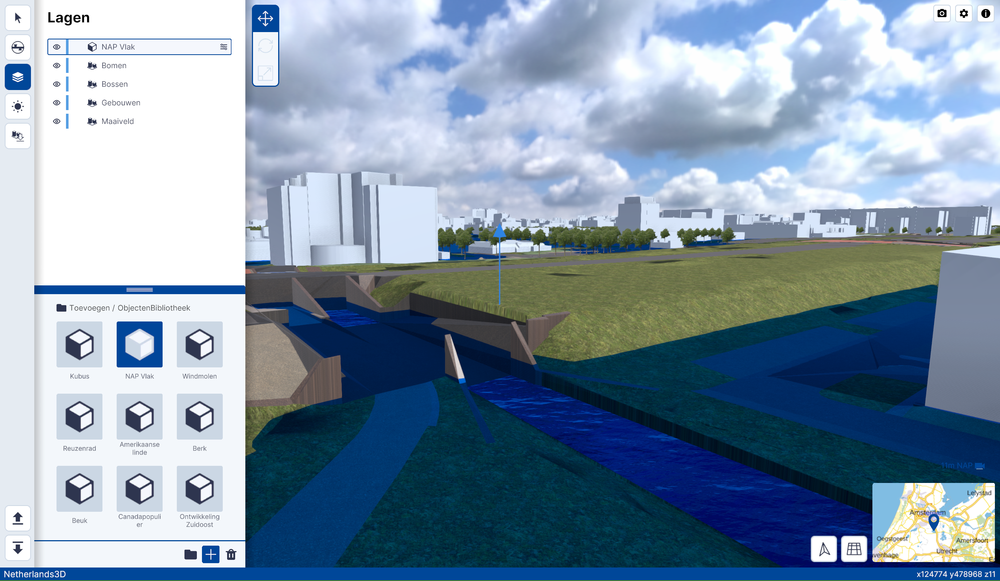
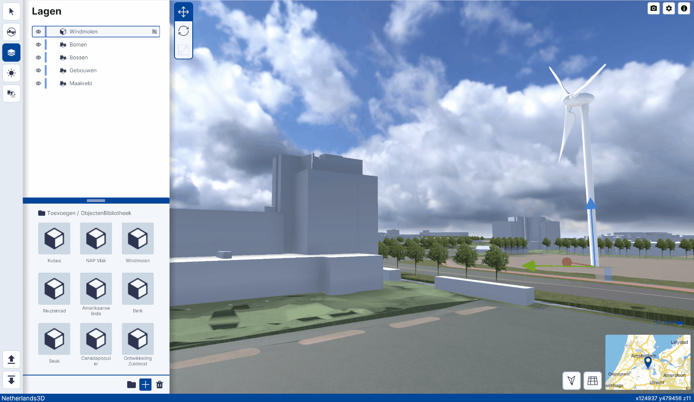

# Objecten bibliotheek

Functies, Lagen, submenu.  
  
 
_(Afbeelding) Toevoegen / Objecten bibliotheek_

---

## Gedetailleerde beschrijving van de functies

Met de functie Objecten bibliotheek kunnen verschillende **standaard objecten** worden **toegevoegd**.

Je kunt kiezen uit:

//// html | div.two-column

* [Annotatie](#annotatie)
* [Bomen / folder](#bomen)
* [Camera Positie](#camera-positie)
* [Kubus](#kubus)
* [NAP Vlak](#nap-vlak)
* [Ontwikkeling Zuidoost](#ontwikkeling-zuidoost)
* [Reuzenrad](#reuzenrad)
* [Windmolen](#windmolen)

 
_Toevoegen objecten uit de Objecten bibliotheek_

////

---

### Annotatie

Klik op `Annotatie` om een opmerking in de viewer te plaatsen. De annotatie start blanco. Door er op te dubbelklikken kan je deze met tekst vullen. Je kan er ook meerdere maken, zodat je notities of opmerkingen bij kan houden.

 
_Annotatie toevoegen_

 
_Annotatie toegevoegd en ingevuld_

---

### Bomen

Klik op `Bomen` om in het submenu van bomen te komen.

---

 
_Bomen menu activeren_

 
_Bomenkeuze; Amerikaanse Linde, Berk, Beuk of Canadapopulier_

Door te klikken op de verschillende bomen wordt een boom geplaatst in de viewer.

 
_Bomen; vlnr Amerikaanse Linde, Berk, Beuk of Canadapopulier_

---
### Camera Positie

Klik op `Camera Positie` om een camera in de viewer te plaatsen. Je plaatst de  camera met de op dat moment ingestelde hoogte en kijkhoek. Op deze manier kan je verschillende camera standpunten maken en bewaren in een project, om zo makkelijk een "view-path" naar keuze te kunnen maken. 

 
_Camera Positie toevoegen_

 
_Camera Positie_

---

### Kubus

Klik op `Kubus` om een kubus in de viewer zichtbaar te maken. De kubus heeft een standaardafmeting van 10x10x10 meter.

 
_Kubus toevoegen_

 
_Kubus ObjectenBibliotheek_

---

### NAP Vlak

Klik op `NAP Vlak` om een (horizontaal)vlak in de viewer zichtbaar te maken. Met dit vlak kun je de NAP hoogte van een terrein of gebouw bepalen of eenvoudig laten zien welke gebieden in Nederland kunnen overstromen als de dijken doorbreken.

 
_NAP Vlak toevoegen_

 
_NAP Vlak_

---

### Ontwikkeling Zuidoost

De functie Ontwikkeling Zuidoost is een bijzonder onderdeel van de Objecten Bibliotheek. Met deze functie worden de Nieuwbouwontwikkelingen in het gebied Amsterdam-Zuidoost in de viewer gekoppeld. Klik op `Ontwikkeling Zuidoost` om deze te activeren.

 
_Ontwikkeling Amsterdam-Zuidoost toevoegen_

 
_Ontwikkeling Amsterdam-Zuidoost_

---

### Reuzenrad

Klik op `Reuzenrad` om een draaiend Reuzenrad in de viewer zichtbaar te maken.  

 
_Reuzenrad ObjectenBibliotheek_

{ width="480px" } 
_Reuzenrad ObjectenBibliotheek_

---

### Windmolen

Klik op `Windmolen` om een Windmolen met draaiende rotor in de viewer zichtbaar te maken. De Windmolen heeft een
standaardhoogte van 70 meter met een Rotordiameter van 54.50 meter. De afmetingen zijn aanpasbaar in het Instellingen
menu van de Windmolen.

 
_Windmolen toevoegen_

{ width="480px" } 
_Windmolen_

---
