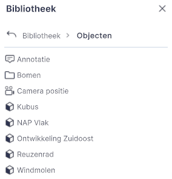
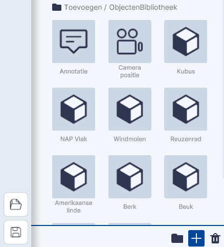
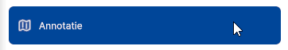
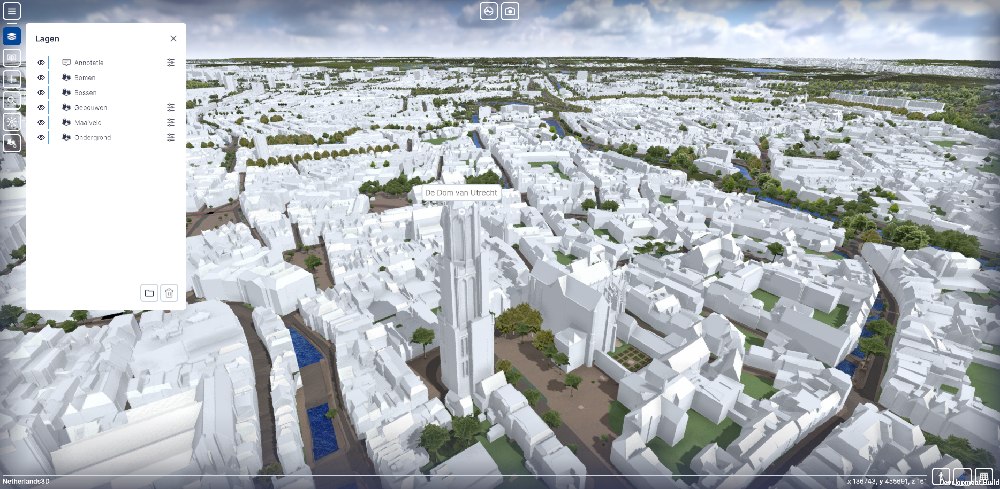
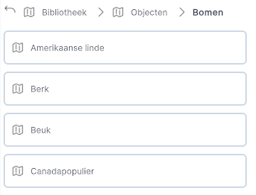
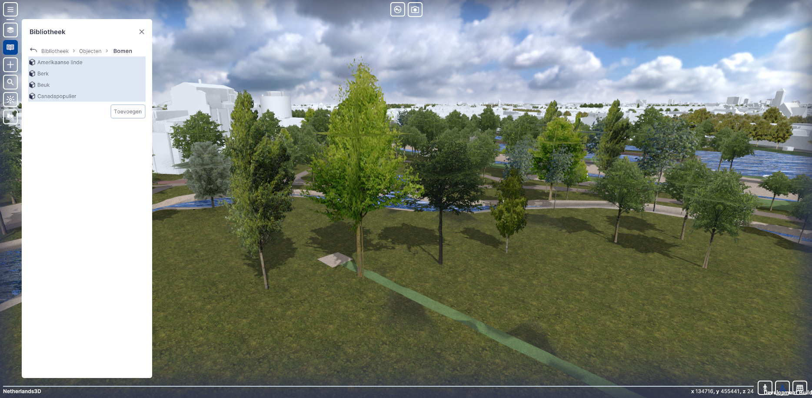
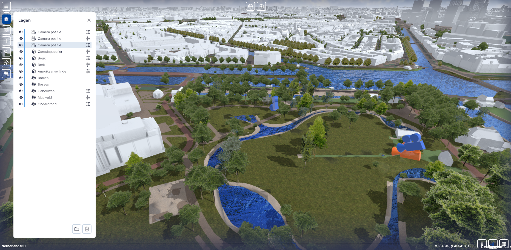
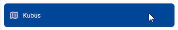
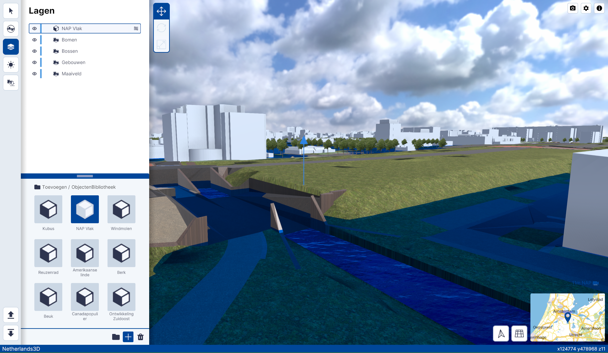
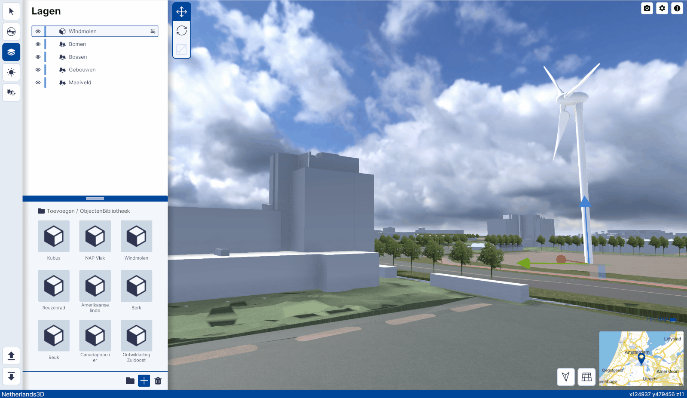

# Objecten bibliotheek

Functies, Lagen, submenu.  
  
 
/// caption
(Afbeelding) Toevoegen / Objecten bibliotheek
///

---

## Gedetailleerde beschrijving van de functies

Met de functie Objecten bibliotheek kunnen verschillende **standaard objecten** worden **toegevoegd**.

Je kunt kiezen uit:

//// html | div.two-column

* [Annotatie](#annotatie)
* [Bomen / folder](#bomen)
* [Camera Positie](#camera-positie)
* [Kubus](#kubus)
* [NAP Vlak](#nap-vlak)
* [Ontwikkeling Zuidoost](#ontwikkeling-zuidoost)
* [Reuzenrad](#reuzenrad)
* [Windmolen](#windmolen)

 
/// caption
Toevoegen objecten uit de Objecten bibliotheek
///

////

---

### Annotatie

Klik op `Annotatie` om een opmerking in de viewer te plaatsen. De annotatie start blanco. Door er op te dubbelklikken kan je deze met tekst vullen. Je kan er ook meerdere maken, zodat je notities of opmerkingen bij kan houden.

 
/// caption
Annotatie toevoegen
///

 
/// caption
Annotatie toegevoegd en ingevuld
///

---

### Bomen

Klik op `Bomen` om in het submenu van bomen te komen.

---

 
/// caption
Bomen menu activeren
///

 
/// caption
Bomenkeuze; Amerikaanse Linde, Berk, Beuk of Canadapopulier
///

Door te klikken op de verschillende bomen wordt een boom geplaatst in de viewer.

 
/// caption
Bomen; vlnr Amerikaanse Linde, Berk, Beuk of Canadapopulier
///

---
### Camera Positie

Klik op `Camera Positie` om een camera in de viewer te plaatsen. Je plaatst de  camera met de op dat moment ingestelde hoogte en kijkhoek. Op deze manier kan je verschillende camera standpunten maken en bewaren in een project, om zo makkelijk een "view-path" naar keuze te kunnen maken. 

 
/// caption
Camera Positie toevoegen
///

 
/// caption
Camera Positie
///

---

### Kubus

Klik op `Kubus` om een kubus in de viewer zichtbaar te maken. De kubus heeft een standaardafmeting van 10x10x10 meter.

 
/// caption
Kubus toevoegen
///

 
/// caption
Kubus ObjectenBibliotheek
///

---

### NAP Vlak

Klik op `NAP Vlak` om een (horizontaal)vlak in de viewer zichtbaar te maken. Met dit vlak kun je de NAP hoogte van een terrein of gebouw bepalen of eenvoudig laten zien welke gebieden in Nederland kunnen overstromen als de dijken doorbreken.

 
/// caption
NAP Vlak toevoegen
///

 
/// caption
NAP Vlak
///

---

### Ontwikkeling Zuidoost

De functie Ontwikkeling Zuidoost is een bijzonder onderdeel van de Objecten Bibliotheek. Met deze functie worden de Nieuwbouwontwikkelingen in het gebied Amsterdam-Zuidoost in de viewer gekoppeld. Klik op `Ontwikkeling Zuidoost` om deze te activeren.

 
/// caption
Ontwikkeling Amsterdam-Zuidoost toevoegen
///

 
/// caption
Ontwikkeling Amsterdam-Zuidoost
///

---

### Reuzenrad

Klik op `Reuzenrad` om een draaiend Reuzenrad in de viewer zichtbaar te maken.  

 
/// caption
Reuzenrad ObjectenBibliotheek
///

{ width="480px" } 
/// caption
Reuzenrad ObjectenBibliotheek
///

---

### Windmolen

Klik op `Windmolen` om een Windmolen met draaiende rotor in de viewer zichtbaar te maken. De Windmolen heeft een
standaardhoogte van 70 meter met een Rotordiameter van 54.50 meter. De afmetingen zijn aanpasbaar in het Instellingen
menu van de Windmolen.

 
/// caption
Windmolen toevoegen
///

{ width="480px" } 
/// caption
Windmolen
///

---
