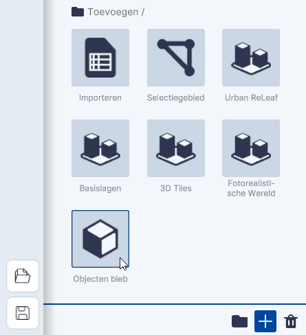

# Objecten bibliotheek

Functionaliteit, Lagen, submenu.  
  
{ width="350px" }  
/// caption
(Afbeelding) Toevoegen / Objecten bibliotheek
///

---

## Gedetailleerde beschrijving van de functionaliteiten

Met de functionaliteit Objecten biep kunnen verschillende **standaard objecten** worden **toegevoegd**.

Je kunt kiezen uit:

//// html | div.two-column

* [Kubus](#kubus)
* [NAP Vlak](#nap-vlak)
* [Windmolen](#windmolen)
* [Reuzenrad](#reuzenrad)
* [Amerikaanse linde](#bomen)
* [Berk](#bomen)
* [Beuk](#bomen)
* [Canadapopulier](#bomen)
* [Ontwikkeling Zuidoost](#ontwikkeling-zuidoost)

{ width="200px"}  
/// caption
(Afbeelding) Toevoegen objecten uit de Objecten bibliotheek
///

////

---

### Kubus

Klik op `Kubus` om een kubus in de viewer zichtbaar te maken. De kubus heeft een standaardafmeting van 10x10x10 meter.

  
/// caption
_(Afbeelding) Kubus ObjectenBibliotheek_  
///

---

### NAP Vlak

Klik op `NAP Vlak` om een (horizontaal)vlak in de viewer zichtbaar te maken. Met dit vlak kun je de NAP hoogte van een
terrein of gebouw bepalen of eenvoudig laten zien welke gebieden in Nederland kunnen overstromen als de dijken
doorbreken.

  
/// caption
(Afbeelding) NAP Vlak  
///

---

### Windmolen

Klik op `Windmolen` om een Windmolen met draaiende rotor in de viewer zichtbaar te maken. De Windmolen heeft een
standaardhoogte van 70 meter met een Rotordiameter van 54.50 meter. De afmetingen zijn aanpasbaar in het Instellingen
menu van de Windmolen.

  
/// caption
(Afbeelding) Windmolen ObjectenBibliotheek
///

---

### Reuzenrad

Klik op `Reuzenrad` om een draaiend Reuzenrad in de viewer zichtbaar te maken.  

---

  
/// caption
(Afbeelding) Reuzenrad ObjectenBibliotheek
///

---

### Bomen

Klik op `Amerikaanse Linde`, `Berk`, `Beuk` of `Canadapopulier` om de verschillende bomen uit de ObjectenBibliotheek in
de viewer zichtbaar te maken.

---

  
/// caption
(Afbeelding) Bomen; vlnr Linde, Berk, Beuk of Canadapopulier ObjectenBibliotheek  
///

---

### Ontwikkeling Zuidoost

De functionaliteit Ontwikkeling Zuidoost is een bijzonder onderdeel van de Objecten Bibliotheek. Met deze functie worden
de Nieuwbouwontwikkelingen in het gebied Amsterdam-Zuidoost in de viewer gekoppeld. Klik op `Ontwikkeling Zuidoost` om
deze te activeren.

/// caption
(Afbeelding) Ontwikkeling Amsterdam-Zuidoost
///
