# Tekengebied

Functies, Lagen, submenu.  
  
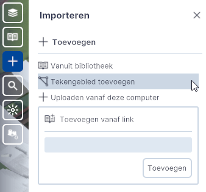  
/// caption
Tekengebied activeren
///

## Gedetailleerde beschrijving van de functies

Met deze functie kan je één of meerdere **polygonen** (gebieden),  **lijnen** of **grids** intekenen.
   
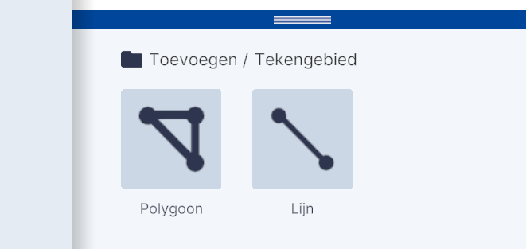 
/// caption
drie keuzes polygoon, lijn of grid
///

Klik op `Tekengebied` om te kiezen tussen het tekenen van een Polygoon, lijn of grid in de 3D-Viewer.

### **Polygoon**

Klik op `Polygoon` en een kleine witte bol verschijnt bij de muisaanwijzer in het 3D scherm. Klik en teken hiermee het volledige veelvlak of polygoon. Sluit het vlak door na het aanbrengen van meerdere punten op de laatste punt te klikken. Hierdoor wordt het vlak ingekleurd. Door op een van de punten te klikken kan je het vlak aanpassen.  
 

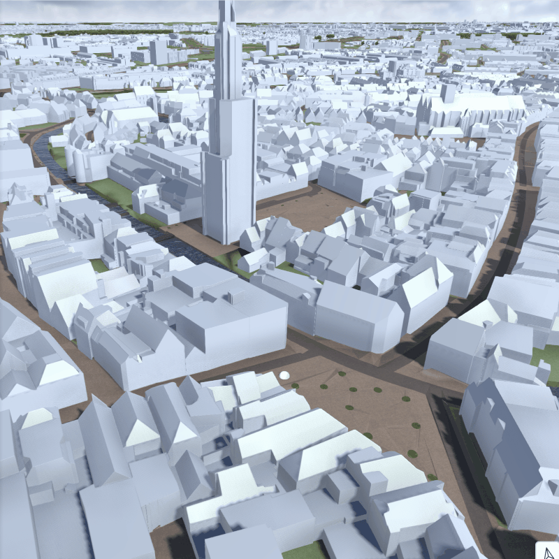 
/// caption
Intekenen polygoon
///  

Je kan meerdere Tekengebieden intekenen.  

---

### **Verspreid objecten in gebied**   
Door een object zoals bijvoorbeeld een boom uit de **Objectenbibliotheek** toe te voegen aan de laag polygoon, activeert de functie **Verspreid objecten in gebied** 

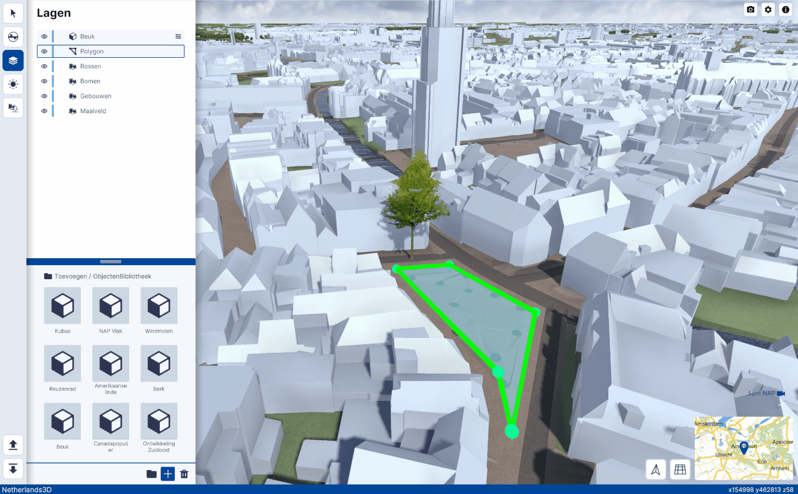 
/// caption
Activeren functie **Verspreid objecten in gebied**
///

Doorloop de volgende stappen;  

- Voeg een object (boom) toe uit de **Objectenbibliotheek**,  
- Sleep het object in **Lagen** op het polygoon,  
- klik op `eigenschappen` van het object,  
- vink `Verspreid objecten in gebied` aan,  
- pas eventueel de Eigenschappen van Verspreiden object aan.  

---

### **Lijn**  
Klik op `Lijn` en een kleine witte bol verschijnt bij de muisaanwijzer in het 3D scherm. Klik in het scherm en teken hiermee de lijn door het eindpunt op de gewenste plek te plaatsen. [Kleuren aanpassen?] Door op één van de eindpunten te klikken kan je de lijn aanpassen.  

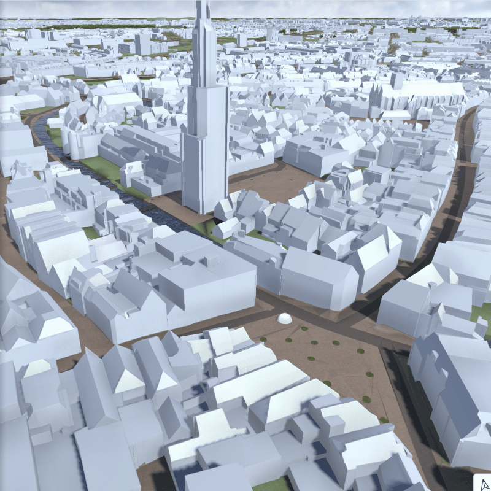  
/// caption
Intekenen lijn
///

De lijndikte kan worden aangepast door op het `instellingen-icoon` te klikken. Het Eigenschappenmenu verschijnt waarmee de lijndikte van 1.00 tot 200.00 meter kan worden aangepast. Standaard is de dikte 10.00 meter.  

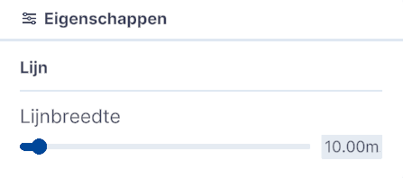 
/// caption
Eigenschappen
///

Je kan meerdere lijnen intekenen.  

---

### **Grid**  
Klik op `Grid` en je kan met de muis, in combinatie met de linkermuisknop en shift-toets een selectiegebied selecteren.  

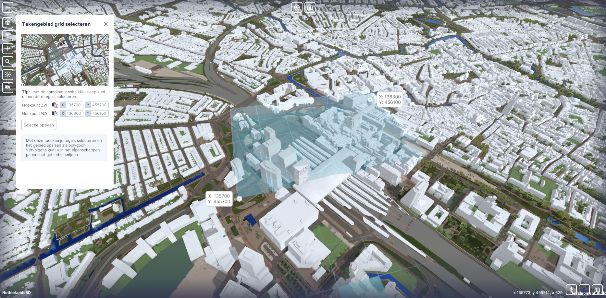 
/// caption
Meerdere secties van 100x100 geselecteerd
///

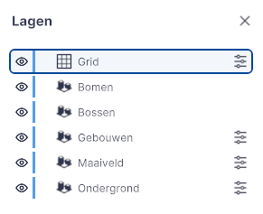 
/// caption
Gridlaag toegevoegd
///

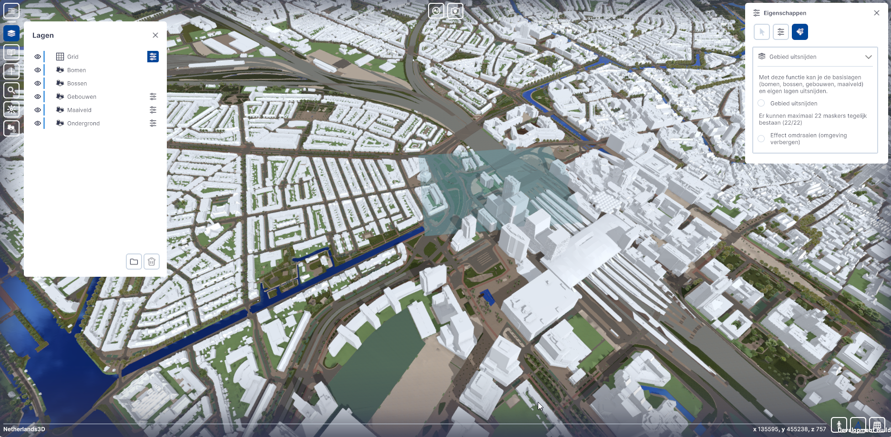 
/// caption
Eigenschappen gridlaag
///

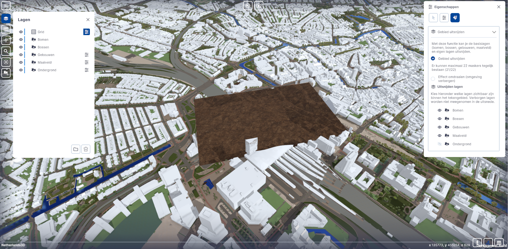 
/// caption
Gebied uitsnijden in gridlaag
///

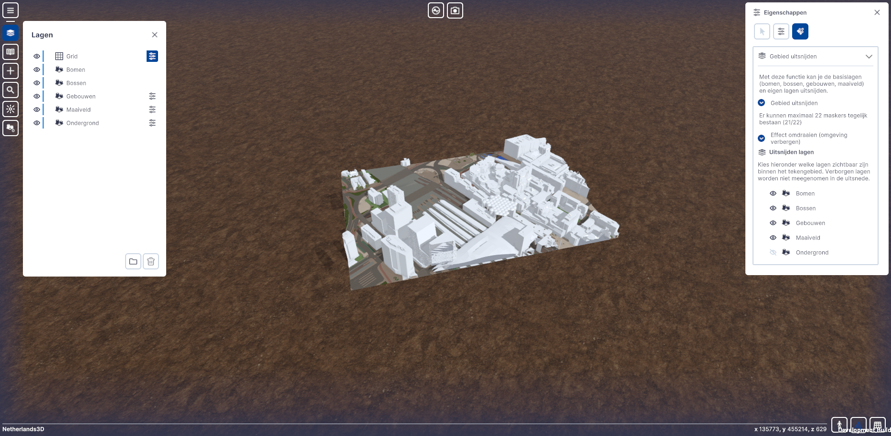 
/// caption
Uitgesneden gebied omdraaien
///

Je kan meerdere grids intekenen. 

!!! tip "Masking and Clipping"
    Bovenstaande handelingen kan je met alle selectiemogelijkheden uitvoeren. Dus ook met een polygoon en een lijn. Zo kan je meerdere gebieden uitsnijden of highlighten. 
    
    Achteraf kan je de geselecteerde lijn(en), gebied(en) en grid(s) ook aanpassen. Bij lijnen en gebieden kan je de laag selecteren en de zichtbare punten oppakken en verplaatsen en bij een grid kan je een nieuwe selectie maken.

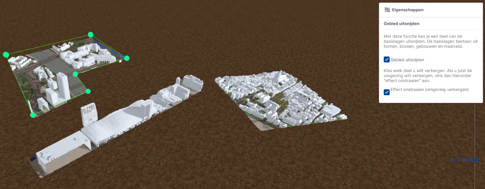 
/// caption
Mogelijkheden uitgesneden gebieden.
///

!!! tip "Nieuw!"
    Stel: je hebt een geojson bestand met een projectgrens die je als masker wilt gebruiken, dat kan! Selecteer het gewenste vlak uit je geojson bestand en klik op het icoontje linksboven naast het layerpanel. Het vlak wordt dan omgezet tot een maskerlaag, zodat je die direct als clippingmask kan inzetten. 

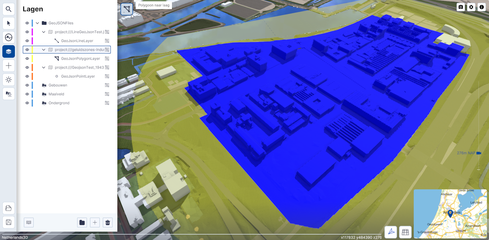 
/// caption
Masker maken van geselecteerd geojson vlak.
///

---
  