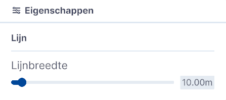

# Tekengebied

Functies, Lagen, submenu.  
  
{ width="350px" }  
_(Afbeelding) Toevoegen / Tekengebied_

---

## Gedetailleerde beschrijving van de functies

Met deze functie kan je om één of meerdere **Polygonen** (gebieden),  **lijnen** of **grids** intekenen.
   
{ width="350px" }  
_(Afbeelding) Toevoegen / Tekengebied_

Klik op `Tekengebied` om te kiezen tussen het tekenen van een Polygoon, lijn of grid in de 3D-Viewer.

### **Polygoon**

Klik op `Polygoon` en een kleine witte bol verschijnt bij de muisaanwijzer in het 3D scherm. Klik en teken hiermee het volledige veelvlak of polygoon. Sluit het vlak door na het aanbrengen van meerdere punten op de laatste punt te klikken. Hierdoor wordt het vlak ingekleurd. Door op een van de punten te klikken kan je het vlak aanpassen.  
 

{ width="350px" }  
_(Afbeelding) Intekenen polygoon_  

Je kan meerdere Tekengebieden intekenen.  

---

### **Verspreid objecten in gebied**   
Door een object zoals bijvoorbeeld een boom uit de **Objectenbibliotheek** toe te voegen aan de laag Polygon, activeert de functie **Verspreid objecten in gebied** 

  
_(Afbeelding) Activeren functie **Verspreid objecten in gebied**._  

Doorloop de volgende stappen;  

- Voeg een object (boom) toe uit de **Objectenbibliotheek**,  
- Sleep het object in **Lagen** op het Polygon,  
- klik op `eigenschappen` van het object,  
- vink `Verspreid objecten in gebied` aan,  
- pas eventueel de Eigenschappen van Verspreiden object aan.  

---

### **Lijn**  
Klik op `Lijn` en een kleine witte bol verschijnt bij de muisaanwijzer in het 3D scherm. Klik in het scherm en teken hiermee de lijn door het eindpunt op de gewenste plek te plaatsen. [Kleuren aanpassen?] Door op één van de eindpunten te klikken kan je de lijn aanpassen.  

{ width="350px" }  
_(Afbeelding) Intekenen lijn_  

De lijndikte kan worden aangepast door op het `instellingen-icoon` te klikken. Het Eigenschappenmenu verschijnt waarmee de lijndikte van 1.00 tot 200.00 meter kan worden aangepast. Standaard is de dikte 10.00 meter.  

{ width="350px" }  
_(Afbeelding) Eigenschappen_  

Je kan meerdere lijnen intekenen.  

---

### **Grid**  
Klik op `Grid` en je kan met de muis, in combinatie met de linkermuisknop en shift-toets een selectiegebied selecteren.  

_(Afbeelding) Meerdere secties van 100x100 geselecteerd._
 

_(Afbeelding) Gridlaag toegevoegd._
 

_(Afbeelding) Eigenschappen gridlaag._
 

_(Afbeelding) Gebied uitsnijden in gridlaag._
 

_(Afbeelding) Uitgesneden gebied omdraaien._
 

Je kan meerdere grids intekenen.
 

!!! tip "Masking and Clipping"
    Bovenstaande handelingen kan je met alle selectiemogelijkheden uitvoeren. Dus ook met een polygoon en een lijn. Zo kan je meerdere gebieden uitsnijden of highlighten. 
    
    Achteraf kan je de geselecteerde lijn(en), gebied(en) en grid(s) ook aanpassen. Bij lijnen en gebieden kan je de laag selecteren en de zichtbare punten oppakken en verplaatsen en bij een grid kan je een nieuwe selectie maken.

_(Afbeelding) Mogelijkheden uitgesneden gebieden._
 
  