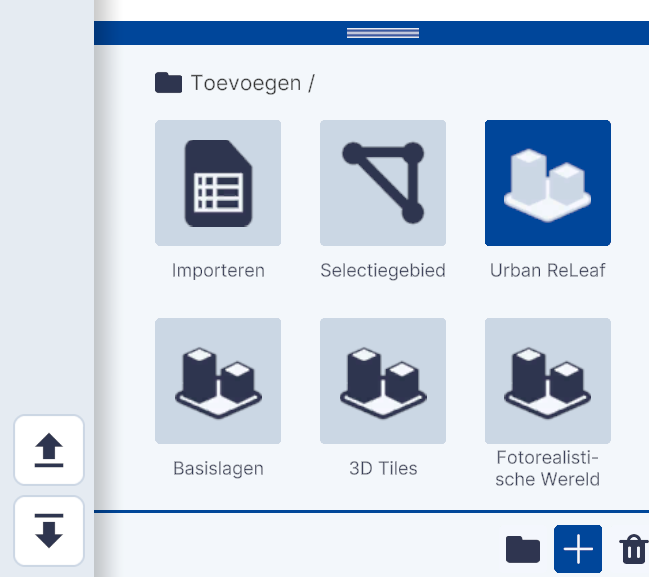
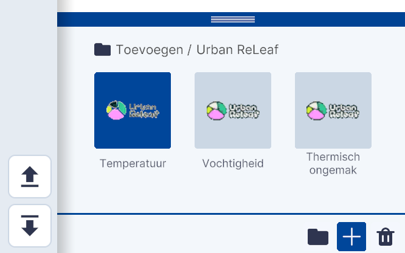
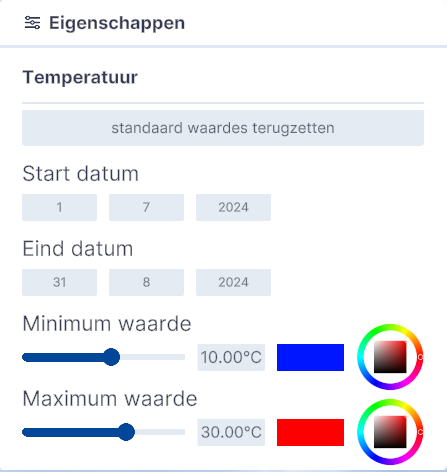

# Urban ReLeaf

Functies, Lagen, submenu.  
  
{ width="350px" }  
_(Afbeelding) Toevoegen / Urban ReLeaf_

---

## Gedetailleerde beschrijving van de functies

Met de functie Urban ReLeaf kunnen de **resultaten van het Klimaatonderzoek** dat van 1 juli tot en met 31 augustus 2024 is **uitgevoerd in de Provincie Utrecht** worden gekoppeld en gevisualiseerd.  
 
Het klimaat is op drie factoren gemeten in de zones die als hexagoon worden weergegeven;
 
* Temperatuur  
* Vochtigheid  
* Thermisch ongemak  

De kleur van de hexagoon vertegenwoordigd een gemiddelde van de gemeten waarden het gebied.  

---

### **Toevoegen**

Door op `Temperatuur`, `Vochtigheid` en/of `Thermisch ongemak` te klikken wordt de bijbehorende laag toegevoegd en worden de hexagonen geladen.  
 
{ width="350px" }  
_(Afbeelding) Toevoegen / Urban ReLeaf_

---

### **Instellingen**

Door in Lagen op het `instellingen-icoon` te klikken kunnen de **eigenschappen van de (temperatuur) weergave** worden aangepast.  
 
{ width="350px" }  
_(Afbeelding) Eigenschappen van de hexagoon-weergave_  
 
---

**Datum**  
Met het **aanpassen** van de `Start datum` en/of de `Eind datum` kunnen de **uitkomsten** van een in –te-stellen periode worden **weergegeven**. Standaard zijn de uitkomsten van de start tot het eind van het onderzoek weergegeven.  
 
---

**Waarden**  
Met het aanpassen van `Minimum waarde` en/of `Maximum waarde` – door de schuif naar links of naar rechts te verplaatsen - worden de **gebieden** die binnen de in-te-stellen **bandbreedte** vallen **weergegeven**. Met de `kleuren-tool` kan het kleurenverloop van minimum- naar maximumwaarde worden aangepast.  
 
  
_(Afbeelding) Weergave uitkomsten Temperatuurmeting Urban ReLeaf_  
  
Kijk op [https://urbanreleaf.eu/](https://urbanreleaf.eu/) voor meer informatie.
  