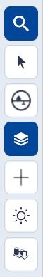
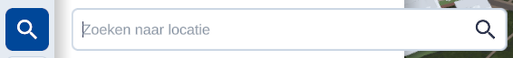
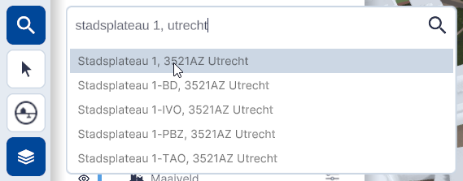

# Zoekfunctie

Functie, hoofdmenu.

){ style="height:230px;width:50px"  align=left }
 

Met de zoekfunctie kan je, naast de zoekfunctie in het instellingenmenu, ook binnen de **3D Viewer direct zoeken naar een adres of locatie**.

---

## Gedetailleerde beschrijving van de functie

### Zoekbalk

Na het klikken op het vergrootglas opent de **zoekbalk**.

{ width="350px" }  
/// caption
_(Afbeelding) Zoekbalk geopend_
///

---

### Zoekresultaat

Tijdens het invullen van een **plaats of adres**, vindt het systeem al de eerste resultaten. Staat de gewenste plaats of adres er al tussen, dan kan je **direct op het resultaat** klikken om deze te activeren. De camera **springt** dan direct naar de gekozen locatie. 

{ width="350px" }
/// caption
(Afbeelding) _Zoekbalk resultaat_
///

