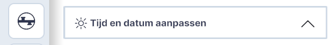
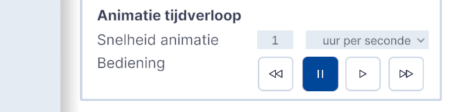

# Zonnestand

Functionaliteit, hoofdmenu.  
{ style="height:230px;width:50px"  align=left }

**Zonnestand** is een zon- en schaduw-simulatie tool die is ontwikkeld om gebruikers te helpen de impact van zonlicht en schaduwen in datalagen en ontwerpen op een specifieke locatie eenvoudig te visualiseren.  
Door gebruikers in staat te stellen basisparameters in te voeren, zoals tijd en datum, genereert Zonnestand real-time schaduwprojecties, waardoor het toegankelijk is voor data-specialisten, ontwerpers, docenten en hobbyisten. 

Dit hoofdstuk beschrijft de belangrijkste functionaliteiten van Zonnestand geeft uitleg over de interface en essentiële functies.

Daarnaast is het mogelijk om een schaduwstudie te maken met de functie **Schaduwstudie**. Hiermee is het mogelijk om van de standaard 12 momenten in het jaar een schermafbeelding te maken en deze te downloaden via een .zip bestand. Deze afbeelding zijn bijvoorbeeld te gebruiken in stedenbouwkundige rapporten.

---

## Overzicht van functionaliteiten

Door het **aanpassen van datum** en tijd wordt de **zonnestand realistisch weergegeven** voor de **gekozen locatie** en het **gekozen moment**. Met animatie tijdverloop wordt het verloop van de schaduw gedurende de dag en nacht realistisch weergegeven. De snelheid van het verloop is instelbaar. 

<video controls>
<source src="../video/zonnestand.viewer.mp4" type="video/mp4">
</video>
_(Video) Functionaliteit Zonnestand_

---

## Gedetailleerde beschrijving van de functionaliteiten

### **Menu**
Door met de muis op het `Zonnestand-icoon` in het hoofdmenu te klikken wordt de tool actief.  
Het menu klapt open en de **instellingen worden zichtbaar**.

{ width="350px" }  
_(Afbeelding) Zonnestand-menu_

---

### **Functionaliteiten**

* **Pull down**   
  Door op de `pijl` te klikken wordt het menu `Tijd en datum aanpassen` ingeklapt. Door vervolgens weer op de `pijl` te klikken klapt het menu `Tijd en datum aanpassen` uit.

{ width="350px" }

---

* **Tijd en Datum 1**   
  Vul het gewenste tijdstip bij  
  `Tijd`	in `uur:minuut` en de gewenste datum bij  
  `Datum` in `dag:maand;jaaren` en druk op `enter`.

{ width="350px" }

Het effect van de nieuwe zonnestand en bijbehorende schaduwval zijn direct zichtbaar.

---

* **Tijd en Datum 2**    
  Door het `Zon-icoon` handmatig over de gestippelde boog te verslepen wordt de zonnestand en bijbehorend tijdstip aangepast. Zonnestand houdt hierbij automatisch rekening met zonsopgang en –ondergang. Zodra het tijdstip zich tussen zonsondergang en –opgang bevindt, verandert het icoon in een maan. 

{ width="350px" }

In het geval het tijdstip zich tussen zonsondergang en –opgang bevindt, is er geen schaduw zichtbaar.

---

* **Tijd en Datum (herstel)**  
  Door op het icoon `Herstel tijd en datum` te klikken wordt de actuele datum en tijd van het computersysteem van de gebruiker overgenomen.

{ width="350px" }

---

* **Animatie tijdverloop realtime**   
  Standaard staat de Snelheid animatie ingesteld op `realtime`. De `pauze- en afspeelknop` hebben geen functie.

{ width="350px" }

---

* **Animatie tijdverloop uur per seconde**   
  Door in het pull down menu te kiezen voor `uur per seconde` kan de **animatie van het verloop van de zon** vanaf de ingestelde datum en tijdstip worden gestart met de `afspeelknop`. De andere knoppen van de interface worden dan ook actief.  
  Met de `pauze knop` kan de animatie worden gestopt. Met de `forward` resp. `backward` knop kan de snelheid van de animatie met hele stappen van 1 uur per seconde worden versneld resp. vertraagd.

{ width="350px" }

---

###  **Opslaan instellingen**

De instellingen van de functie Zonnestand zijn onderdeel van het Netherlands 3D bestand en worden opgeslagen met de functie `Project Opslaan`.

### **Schaduwstudie**

**Pull down**   
Door op de `pijl` te klikken wordt het menu `schaduwstudie` ingeklapt. Door vervolgens weer op de `pijl` te klikken klapt het menu `schaduwstudie` uit.

{ width="350px" }

**Download**   
Door op de knop `download` te klikken wordt een serie van 12 afbeeldingen gegenereerd volgens onderstaande normen en vervolgens verzameld in een `.zip` bestand met als naam `2025-03-05-T15-00-Schaduwstudie.zip` 

{ width="350px" }

*De functionaliteit maakt afbeeldingen van de actuele camerastandpunt, dus houd er rekening mee dat de resultaten afhankelijk zijn van de keuze van het camerastandpunt.*

### **Verantwoording**
**Data en tijdstippen**

Hoewel voor de bezonningsuren overal de TNO-norm wordt aangehouden, is er voor de schaduwstudie geen officiële standaard. Wel wordt deze set data en tijden gebruikt door de meeste gemeenten en online tools:
**21 maart en 23 september** (halverwege tussen kortste en langste dag)
**21 juni** (dag met de meeste zonuren)
**22 december** (dag met de minste zonuren)

- 21-03 (en/of 23-09) om 09:00u
- 21-03 (en/of 23-09) om 12:00u
- 21-03 (en/of 23-09) om 15:00u
- 21-03 (en/of 23-09) om 18:00u
- 21-06 om 09:00u
- 21-06 om 12:00u
- 21-06 om 15:00u
- 21-06 om 18:00u
- 21-06 om 20:00u
- 22-12 om 09:00u
- 22-12 om 12:00u
- 22-12 om 15:00u

Meer informatie over schaduwstudies en bezonning, staat op deze website https://iplo.nl/thema/licht/bezonning/

**Bepaling Zonnestand**

Voor het bepalen van de zonnestand maken we gebruik van het NOAA Solar Position Algorithm (SPA). Voor meer informatie kijk op https://gml.noaa.gov/grad/solcalc/index.html  
