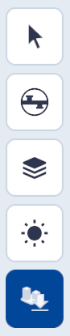
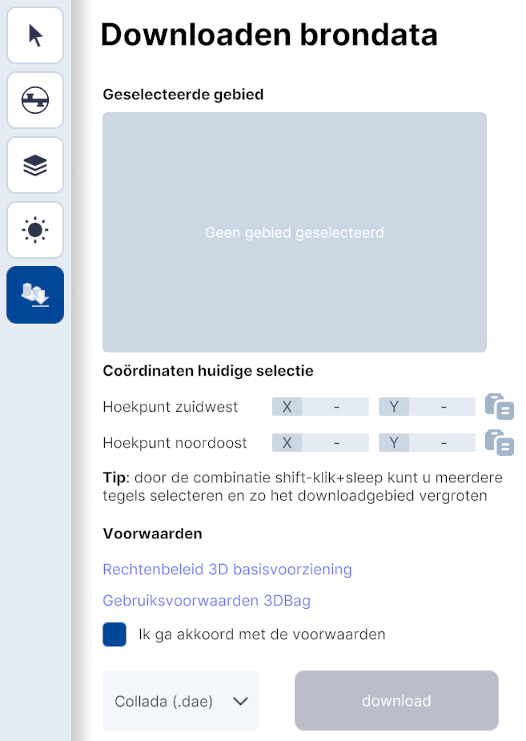
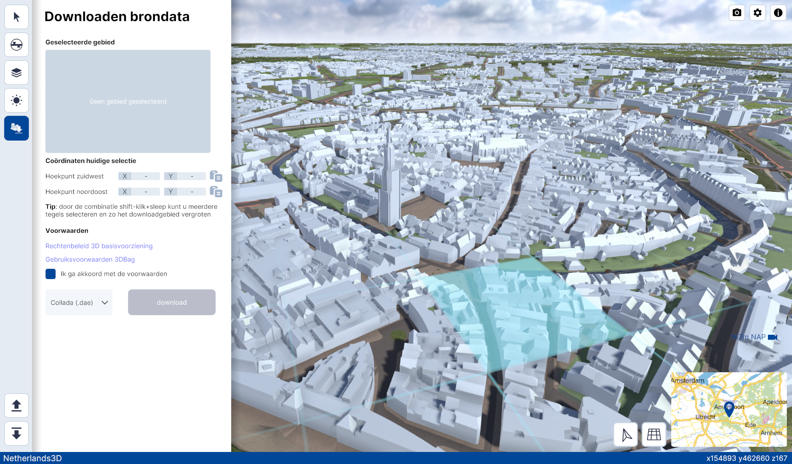
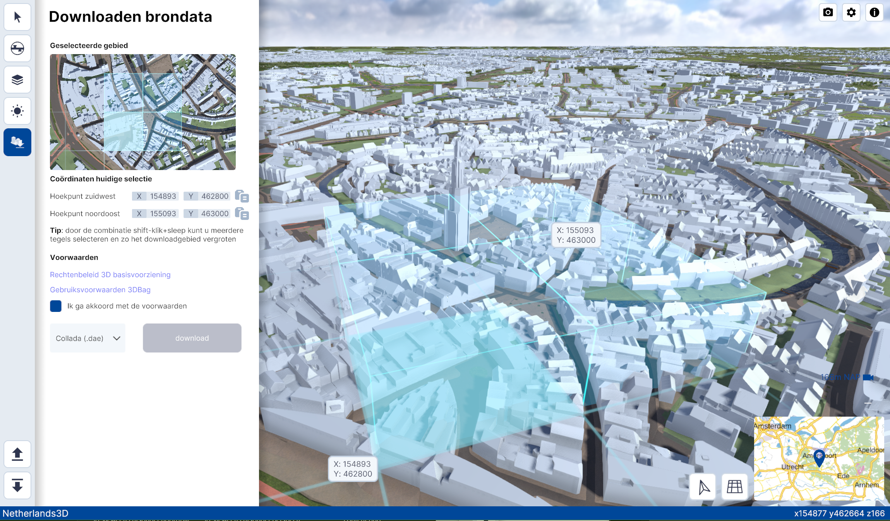

# Gebied downloaden

Functionaliteit, hoofdmenu.  
{ style="height:230px;width:50px" }

Met de functionaliteit Gebied Downloaden kunnen delen van een gebied als bestand worden gedownload. Deze functionaliteit bevordert de aansluiting en uitwisseling met andere Digital Twins. 

Dit hoofdstuk beschrijft de belangrijkste functionaliteiten van Gebied Downloaden en geeft uitleg over de interface en essentiële functies.

## Overzicht van functionaliteiten

Met het opslaan van delen van een gebied in andere software worden ingeladen. 

<video controls>
<source src="../video/gebied.downloaden.mp4" type="video/mp4">
</video>

## Gedetailleerde beschrijving van de functionaliteiten

### **Menu**

{ width="350px" }

### **Functionaliteiten**

* #### **Gebied downloaden**   
Na het activeren van de functionaliteit wordt het menu actief en kun je met de muis meerdere secties van 100x100 meter selecteren.

 
* #### **Selecteer gebied**   
Na het activeren van de functionaliteit wordt het menu actief en kun je met de muis meerdere secties van 100x100 meter selecteren. Door met de muis, in combinatie met de linkermuisknop en shift-toets te slepen kun je gebied vergroten.  

Het selectiegebied is loodrecht op de horizontale-as/op het noorden georiënteerd.

* #### **Coördinaten huidige selectie**   
Met deze functie kun je de coördinaten van het hoekpunt zuidwest en het hoekpunt noordoost naar het klembord kopiëren.

* #### **Voorwaarden**   
NB! Voordat je het geselecteerde gebied kunt downloaden, dien je akkoord te gaan met de voorwaarden. Je vindt de link onder **Voorwaarden**.

* #### **Downloaden**   
Klik op **download** om een .dea (Collada) bestand te downloaden. Het bestand kun je in een 3D modelleerprogramma zoals bijvoorbeeld Blender importeren.