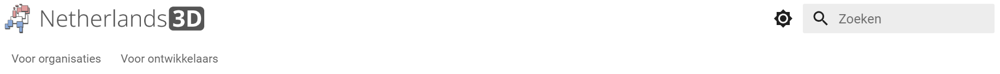
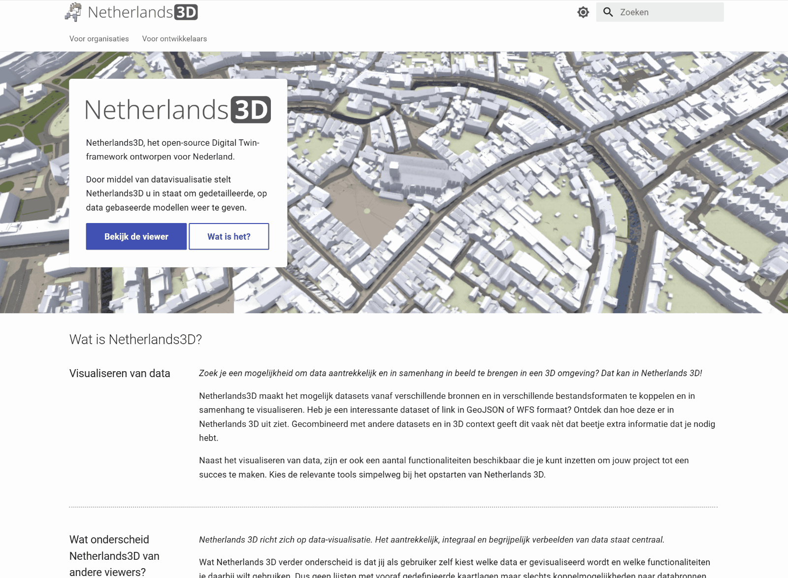
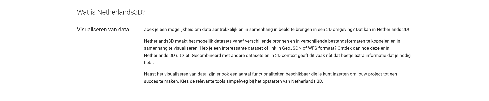
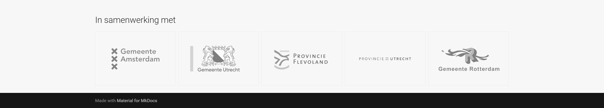

# Home
De homepage is het portaal naar de verschillende hoofdstukken en functionaliteiten op Netherlands.eu. De hoofdstukken bevatten vooral informatie over Netherlands 3D en is onderverdeeld in de doelgroepen Organisaties (gebruikers) en Ontwikkelaars.   
Dit hoofdstuk beschrijft de belangrijkste functionaliteiten van de homepage en de gebruikersinterface.   

## Overzicht van functionaliteiten

De homepage van Netherlands3d.eu biedt toegang tot de verschillende hoofdstukken en functionaliteiten. 

## Gedetailleerde beschrijving van de functionaliteiten

### **Hoofdmenubalk**

### **Functionaliteiten**

* #### **Voor gebruikers**   
Dit hoofdstuk bevat de handleiding voor het gebruik van Netherlands3D.eu.  
Je vind hier de gedetailleerde beschrijving van alle functionaliteiten ondersteund met afbeeldingen en/of filmpjes. 

* #### **Voor organisaties**   
Dit hoofdstuk is onder ontwikkeling en bevat straks een uitgebreide bron van informatie. Het doel is om organisaties te ondersteunen met gidsen, best practices en antwoorden op veel gestelde vragen die essentieel zijn voor het gebruik van het Netherlands3D platform. 
 
* #### **Voor ontwikkelaars**   
Dit hoofdstuk bevat technische documentatie. Deze documentatie is bedoeld voor ontwikkelaars die willen begrijpen hoe het platform werkt, de architectuur willen verkennen en nieuwe modules of functionaliteiten willen bijdragen.

* #### **Schermmodus**{ width="30" }   
Door op dit icoon te klikken kan de interface kan de modus veranderd worden in * Dark; lichte tekst op een donkere achtergrond of * Light; donkere tekst op een lichte achtergrond. In de Dark modus gebruikt het systeem minder energie en hoeft het systeem in het geval van een laptop minder snel te worden opgeladen.

Dark/Light modus

* #### **Zoeken**   
Deze zoekfunctie biedt de mogelijkheid om naar trefwoorden te zoeken in Netherlands3D.eu. Vul de zoekterm(en) in bij **Zoeken** en de lijst met klikbare resultaten wordt in de context (hoofdstuk en alinea) getoond.

###  **Headline**

* #### **Bekijk de viewer**   
Met de knop **Bekijk de viewer** in de headline wordt de 3D-viewer functionaliteit gestart.  
(Zie 3D-viewer functionaliteit voor de beschrijving.)
 
* #### **Wat is het**   
Met de knop **Wat is het?** wordt de tekst ’Wat is Netherlands3D?’ onder het overlay scherm naar boven gehaald.

###  **Content**

De content beschrijft wat Netherlands3D.eu is.

### **Footer** 

Deze laag bevat de logo's van de bij Netherlds3D.eu betrokken provincies en de mogelijkheid om door de hoofdstukken van het hoofdmenu in de hoofdbalk te bladeren.