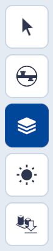
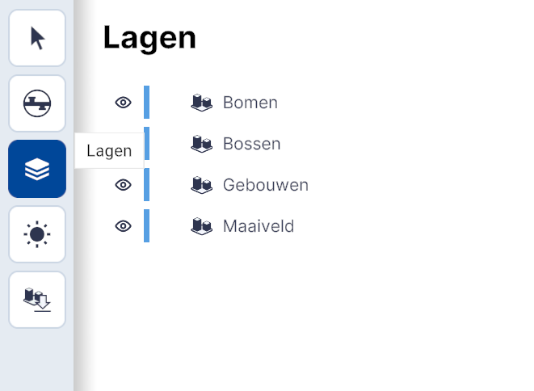
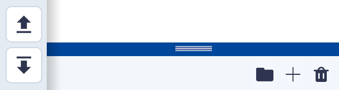
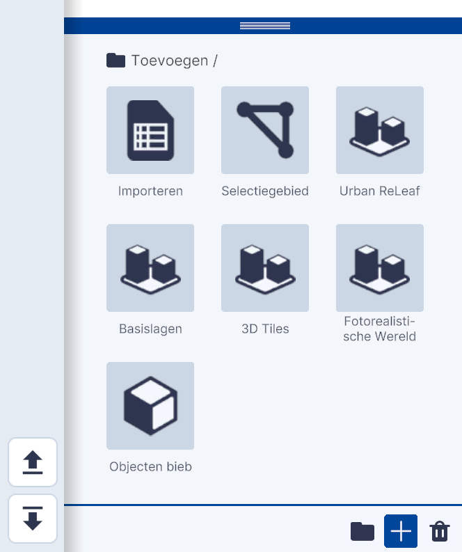

# Lagen

(Kern)functionaliteit, hoofdmenu.  
{ style="height:230px;width:50px" }

Lagen is dé kernfunctionaliteit van Netherlands3d.eu. Deze functionaliteit biedt de mogelijkheden om datalagen en objecten uit verschillende bronnen te (ont)koppelen en de zichtbaarheid hiervan aan te passen. 
 
Dit hoofdstuk beschrijft de belangrijkste functionaliteiten van Lagen en geeft uitleg over de gebruikersinterface en essentiële functies.

## Overzicht van functionaliteiten

Door het uit-/aanvinken van datalagen worden deze verborgen of getoond. 
Met behulp van links en/of het importeren van bestanden worden datalagen en objecten gekoppeld.

<video controls>
<source src="../video/gebied.downloaden.mp4" type="video/mp4">
</video>

## Gedetailleerde beschrijving van de functionaliteiten

### **Menu (linksboven)**

{ width="350px" }

### **Functionaliteiten**

* #### **Standaardlagen**   
De lagen Bomen, Bossen, Gebouwen en Maaiveld zijn in de basisversie standaard gekoppeld.

* #### **Laagvolgorde**   
Met de muis en linkermuisknop kan de volgorde van de lagen worden gewijzigd. Dit heft alleen effect voor lagen met WMS-data [zie Voorbeeld koppelen bestand met URL].

* #### **Tonen/verbergen**   
Door het uit-/aanvinken van datalagen worden deze verborgen of getoond. 
Met behulp van links en/of het importeren van bestanden worden datalagen en objecten gekoppeld.

* #### **Transformatie tool**   
De locatie, oriëntatie en schaal van toegevoegde objecten wordt met de transformatie tool aangepast.

Transformatie tool geactiveerd door selectie in Lagen.   
 
* #### **Eigenschappen**   
Van toegevoegde objecten en sommige lagen kunnen eigenschappen zoals b.v. de locatie, oriëntatie en schaal maar ook object/laag specifieke eigenschappen worden aangepast. Klik op het icoon om het eigenschappenmenu te openen.

Instellingen (rechts) actief.

### **Menu (linksonder)**

{ width="350px" }

### **Functionaliteiten**

* #### **Organiseren**   
Met het Icoon wordt een folder aangemaakt waarvan de naam kan worden aangepast (dubbelklikken) en waarin de gekoppelde lagen of objecten kunnen worden gesleept. Dit helpt bij het organiseren en overzichtelijk houden van de gekoppelde lagen en/of objecten.

* #### **Verwijderen**   
Met het  icoon wordt de geselecteerde laag of object verwijderd. Dit kan ook met de del/delete-toets van het toetsenbord. NB! Sla voor het verwijderen alle instellingen op met Project Opslaan. Er is GEEN undo-functionaliteit.

* #### **Toevoegen**  
Het koppelen van datalagen al dan niet in combinatie met objecten is dé kernfunctionaliteit van Netherlands3d.eu. Met het + icoon opent het Toevoegen menu en zijn de verschillende teken-, koppel- en importmogelijkheden (gedeeltelijk) zichtbaar. Door met de muis de blauwe bovenbalk omhoog te slepen opent het menu volledig.  
 
Het menu bevat de volgende 7 teken- koppel- en importmogelijkheden;
  
{ width="350px" }  
Toevoegen menu

[1. Importeren (link)](../toevoegen-importeren/)  
[2. Tekengebied (link)](../toevoegen-tekengebied/)  
[3. Urban ReLeaf (link)](../toevoegen-urban-releaf/)  
[4. Basislagen (link)](../toevoegen-basislagen/)  
[5. 3D Tiles (link)](../toevoegen-3d-tiles/)  
[6. Fotorealistische Wereld (link)](../toevoegen-fotorealistische-wereld/)  
[7. Objecten biep (link)](../toevoegen-objecten-biep/)  

