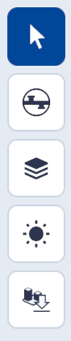
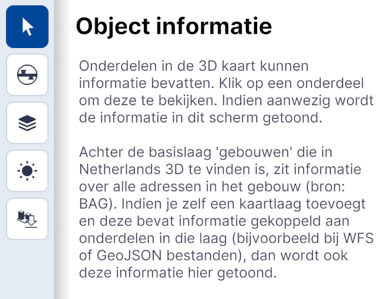
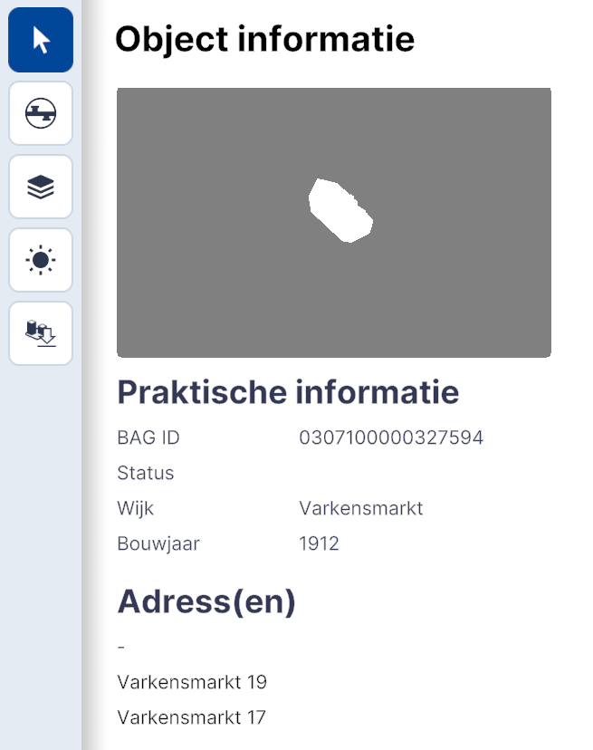

# Object Informatie

Functionaliteit, hoofdmenu.  
{ style="height:230px;width:50px" }

Met de BAG Object Informatie tool kan de gebruiker schematische 3D modellen van alle objecten in Nederland bekijken en gedetailleerde object (gebouw) informatie opvragen.   

BAG Object Informatie is onderdeel van de basisfunctionaliteit in Netherlands3D.eu. Alle objecten op de laag 'Gebouwen' komen uit de 3DBAG. Dit is een up-to-date land dekkende dataset met 3D gebouwmodellen van Nederland.   

Dit hoofdstuk beschrijft de belangrijkste functionaliteiten van BAG Object Informatie en geeft uitleg over de interface en essentiële functies.

## Overzicht van functionaliteiten

Door een object te selecteren kan gedetailleerde object informatie worden opgevraagd.

<video controls>
<source src="../video/object.informatie.mp4" type="video/mp4">
</video>

## Gedetailleerde beschrijving van de functionaliteiten

### **Menu**

{ width="350px" }

### **Object selectie**   
[Muisklik] Klik op een gebouw op de kaart om de Basisregistratie Adressen en Gebouwen (BAG) informatie te bekijken. Het geselecteerde object wordt blauw en de officiële object informatie verschijnt.

{ width="350px" }  
  
### **Praktische informatie**  
De Object informatie bevat de volgende data;

* BAG ID	0000000000000000   
* Status   
* Wijk		[Naam]  
* Bouwjaar	[Jaartal]  
* **(Adress(en))**   
* Adres en Huisnummer  
 
###  **Aanvullende technische details**

De 3DBAG is een up-to-date landsdekkende dataset met 3D gebouwmodellen van Nederland. De 3DBAG is open data. Het bevat 3D modellen op verscheidene detailniveaus welke zijn gegenereerd door de combinatie van twee open datasets: de pand-gegevens uit de BAG en de hoogtegegevens uit de AHN. De 3DBAG wordt regelmatig geüpdatet met de meest recente openlijk beschikbare pand- en hoogtegegevens. 

Via Netherlands3d.eu is het mogelijk vierkante tegels van 100x100 meter te downloaden. Ga hiervoor naar de optie [Gebied downloaden](../gebied-downloaden/) in het hoofdmenu.

###  **Referenties**

Link naar de [API van het Kadaster](https://www.kadaster.nl/zakelijk/producten/adressen-en-gebouwen/bag-api-individuele-bevragingen)