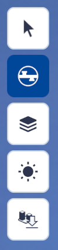
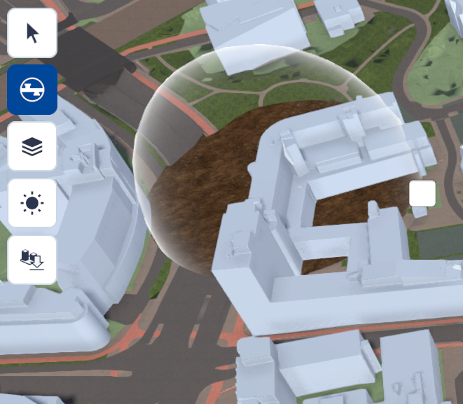

# Ondergrond doorzicht

Functionaliteit, hoofdmenu.  
{ style="height:230px;width:50px" }

Ondergrond doorzicht is een tool die is ontworpen om gebruikers een uitgebreid beeld te geven van de ondergrondse omgeving. Door ondergrondse structuren te visualiseren, kunnen professionals op verschillende gebieden weloverwogen beslissingen nemen en hun operationele efficiëntie verbeteren.    

Dit hoofdstuk geeft een overzicht van de mogelijkheden en toepassingen van de software en laat zien hoe Ondergrond doorzicht dient als een essentiële bron voor het verkennen van wat er onder de oppervlakte ligt. 
 
Dit hoofdstuk beschrijft de belangrijkste functionaliteiten van Ondergrond doorzicht geeft uitleg over de interface en essentiële functies.

## Overzicht van functionaliteiten

Met het doorzicht koepelvenster worden delen van datalagen en/of objecten welke zich onder het maaiveld en binnen de straal van het venster bevinden zichtbaar gemaakt. Met de muis kan het venster verplaatst worden waardoor andere ondergrondse delen zichtbaar worden.

<video controls>
<source src="../video/ondergrond.doorzicht.mp4" type="video/mp4">
</video>

## Gedetailleerde beschrijving van de functionaliteiten

### **Menu**

{ width="350px" }

### **Functionaliteiten**

* #### **Activeren Ondergrond doorzicht**  
Door met de muis op het icoon in het hoofdmenu te klikken wordt de tool actief. Het doorzicht koepelvenster is nu aan de locatie van de muis gekoppeld.
 
* #### **Gebruik/verplaatsen**   
De koepel beweegt mee met de muis over het gebied waarvan de ondergrond zichtbaar moet worden gemaakt.

* #### **Aanpassen grootte diameter**   
Door met de muis over het witte vierkant te bewegen verschijnt een hand waarmee na het [klikken en vasthouden van de linkermuisknop] en het slepen van de muis de grootte van het doorzicht koepelvenster kan worden aangepast. Hiermee wordt een groter c.q. kleiner gebied onder het maaiveld zichtbaar.

{ width="350px" }