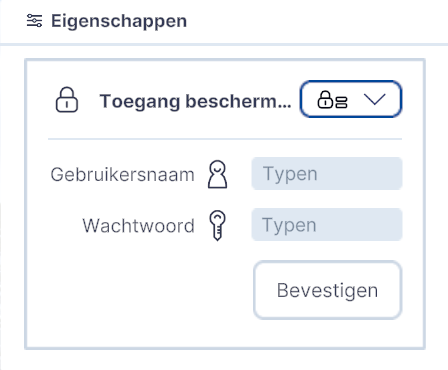

# Fotorealistische Wereld

Functionaliteit, Lagen, submenu.  
  
{ width="350px" }  
Toevoegen / Fotorealistische Wereld

## Gedetailleerde beschrijving van de functionaliteiten

Met de functionaliteit Fotorealistische Wereld kunnen de 3D tiles van Google Earth worden gekoppeld en gevisualiseerd in Netherlands3D.eu.

### **Toevoegen**
Klik op Fotorealistische Wereld en het Eigenschappenmenu wordt rechtsboven in het scherm geopend.  
  
  
Utrecht CS in 3DBAG  
  
NB! Aangezien de 3D Google Earth Tiles een betaalde service van Google is, kan deze functionaliteit niet zonder inlogcode of sleutel worden vrijgegeven.  
  
Klik op Update om verder te gaan.  

### **Met Gebruikersnaam en Wachtwoord**
Toegangsscherm met Gebruikersnaam en Wachtwoord:
{ width="350px" }  
 
Voer bij de Gebruikersnaam en Wachtwoord en klik op Bevestigen. De 3D Tiles worden direct geladen.  
 
Indien er geen gebruikersnaam/wachtwoord beschikbaar is; Ga naar Google en maak via het Google-account een 'sleutel’ aan.  

### **Met Google sleutel**
Toegangsscherm met sleutel:  
 
{ width="350px" }  
 
Plak de sleutel in het veld Typen en klik op Bevestigen. De 3D Tiles worden direct geladen.  
 
  
Utrecht CS in Google Earth 3D Tiles  
 
NB! De Google Earth Tiles zijn (nog) niet voor heel Nederland zichtbaar/beschikbaar. Voor grote delen van NL geldt dat er alleen een topdown satellietfoto beschikbaar is.  
 