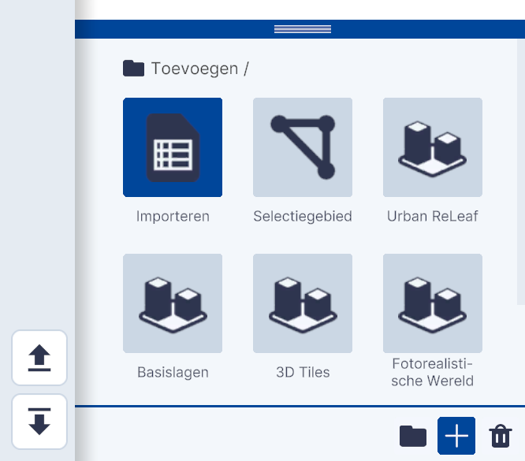
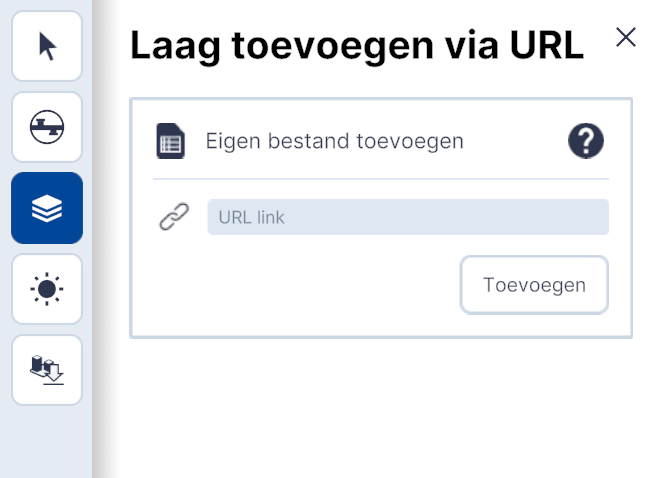
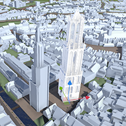

# Importeren

Functionaliteit, Lagen, submenu.  
  
{ width="350px" }  
Toevoegen / Importeren

## Gedetailleerde beschrijving van de functionaliteiten

### **Importeren Eigen bestand**   

De functionaliteit **Importeren** biedt de mogelijkheid om lagen en objecten via het importeren van bestanden of via weblinks te koppelen.
   
{ width="350px" }
   
Met **Eigen bestand** kunnen .obj, .csv en .js bestanden worden gekoppeld.  
Zie ... in het document voor de beschrijving. Na klikken op Eigenbestand opent de Verkenner/Finder en kan het bestand worden geladen.
    
&nbsp;

### **Importeren bestand via URL**   

{ width="350px" }
 
Met **Importeren bestand via URL** worden databronnen via een weblink gekoppeld.
Klik op Bestand via URL. Het Laag toevoegen via URL-menu opent.
   
{ width="350px" }
 
Kopieër en plak de link van het bestand in het vakje [URL link].   
Zie ... in het document voor de beschrijving en bronnen.

Na **Toevoegen** is de link gekoppeld en de data zichtbaar in de viewer.  

## **Voorbeelden**   
### **Bestand Importeren met .OBJ**   
Klik op **Eigen bestand** en importeer het .obj-bestand.
   
  
Gedetailleerde Domtoren middels .obj geïmporteerd.
   
Na het importeren wordt het object in de 3D omgeving en in de lijst onder Lagen zichtbaar.   
De viewer neemt automatisch de oriëntatie en schaal van het object over.
   
Het geselecteerde object kan met de transformatie tools op de juiste locatie of aangepaste oriëntatie en schaal worden gebracht. Klik op het gekoppelde object in Lagen en de transformatie-tool is geactiveerd.
    
{ width="248px" }
{ width="248px" }
{ width="248px" }  
Verplaatsen, roteren en verschalen met de transformatie-tool.
   

   
Met de **Eigenschappen** functie kan de locatie, oriëntatie en schaal van het geimporteerde object handmatig worden ingevoerd.
   
Met **Bestand toevoegen** kan het .mtl-bestand dat bij het .obj-bestand behoord worden ingeladen. Hiermee wordt kleur- en textuur-informatie meegeladen met het 3D-model.

### **Bestand bestand via URL**   
Klik op Bestand via URL en koppel de link.   
 

Voorbeeld 1;  Luchtfoto's van Nederland gekoppeld met WMS-link  
   

Voorbeeld 2;  Vakantie statistieken van het CBS gekoppeld met WMS-link