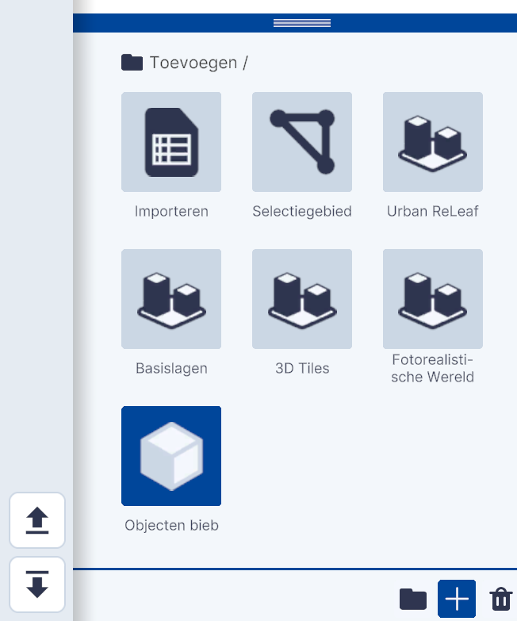
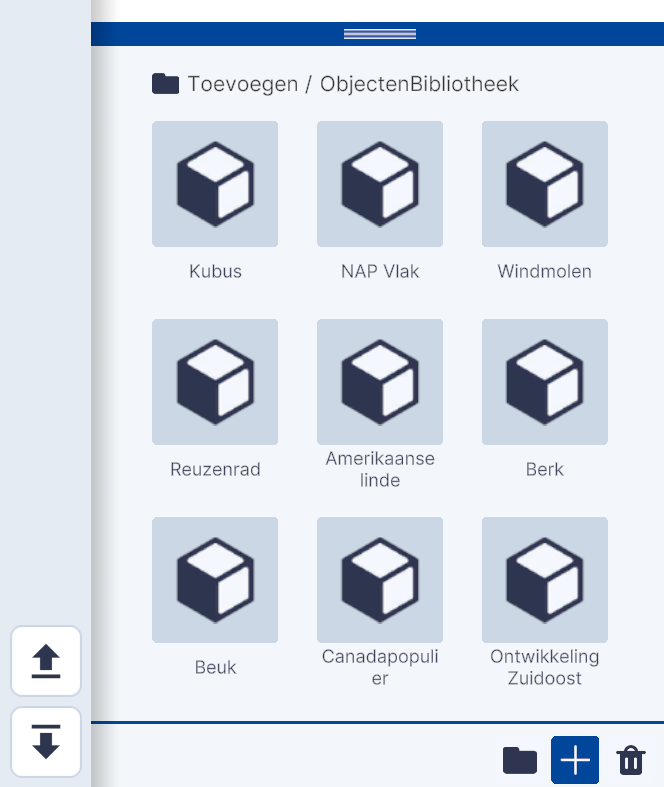
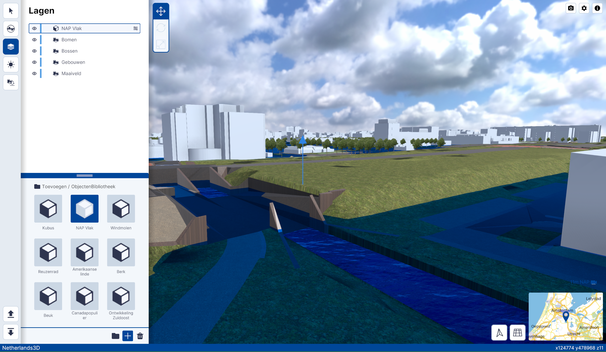
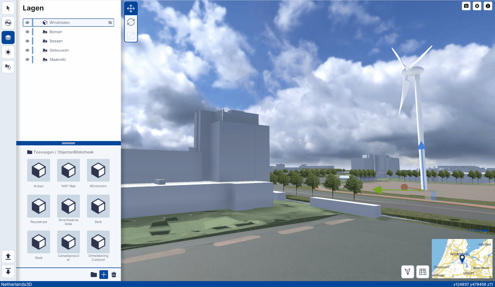
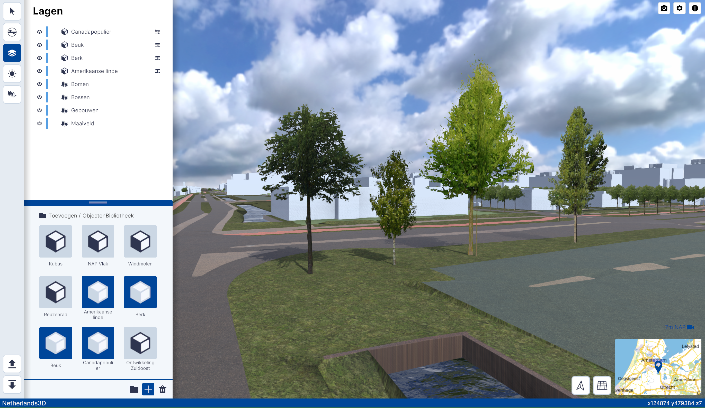

# Objecten biep

Functionaliteit, Lagen, submenu.  
  
{ width="350px" }  
Toevoegen / Objecten biep

## Gedetailleerde beschrijving van de functionaliteiten
Met de functionaliteit Objecten biep kunnen verschillende standaard objecten worden toegevoegd;  
 
{ width="350px" }  
 
Je kunt kiezen uit;

* [Kubus](../toevoegen-objecten-biep/#kubus)  
* [NAP Vlak](../toevoegen-objecten-biep/#nap-vlak)  
* [Windmolen](../toevoegen-objecten-biep/#windmolen)   
* [Reuzenrad](../toevoegen-objecten-biep/#reuzenrad)   
* [Amerikaanse linde](../toevoegen-objecten-biep/#bomen)   
* [Berk](../toevoegen-objecten-biep/#bomen)   
* [Beuk](../toevoegen-objecten-biep/#bomen)   
* [Canadapopulier](../toevoegen-objecten-biep/#bomen)   
* [Ontwikkeling Zuidoost](../toevoegen-objecten-biep/#ontwikkeling-zuidoost)   

###**Kubus**  
Klik op Kubus om een kubus in de viewer zichtbaar te maken. De kubus heeft een standaardafmeting van 10x10x10 meter.  
 
  
Kubus ObjectenBibliotheek  
 
###**NAP Vlak**  
Klik op NAP Vlak om een (horizontaal)vlak in de viewer zichtbaar te maken. Met dit vlak kun je de NAP hoogte van een terrein of gebouw bepalen of eenvoudig laten zien welke gebieden in Nederland kunnen overstromen als de dijken doorbreken.  
 
  
Kubus ObjectenBibliotheek  
 
###**Windmolen**  
Klik op Windmolen om een Windmolen met draaiende rotor in de viewer zichtbaar te maken. De Windmolen heeft een standaardhoogte van 70 meter met een Rotordiameter van 54.50 meter. De afmetingen zijn aanpasbaar in het Instellingen menu van de Windmolen.  
 
  
Windmolen ObjectenBibliotheek  
 
###**Reuzenrad**  
Klik op Reuzenrad om een draaiend Reuzenrad in de viewer zichtbaar te maken. Het reuzenrad heeft een standaardafmeting van ........meter.  
 
  
Reuzenrad ObjectenBibliotheek  
 
###**Bomen**  
Klik op de verschillende bomen in de ObjectenBibliotheek om een **Amerikaanse Linde, Berk, Beuk** of **Canadapopulier** in de viewer zichtbaar te maken.  
 
  
Bomen; vlnr Linde, Berk, Beuk of Canadapopulier ObjectenBibliotheek  
 
###**Ontwikkeling Zuidoost**  
De functionaliteit Ontwikkeling Zuidoost is een bijzonder onderdeel van de ObjectenBibliotheek. Met deze functie worden de Nieuwbouwontwikkelingen in het gebied Amsterdam-Zuidoost in de viewer gekoppeld. Klik op **Ontwikkeling Zuidoost** om deze te activeren.  
 
  
Ontwikkeling Amsterdam-Zuidoost    
 