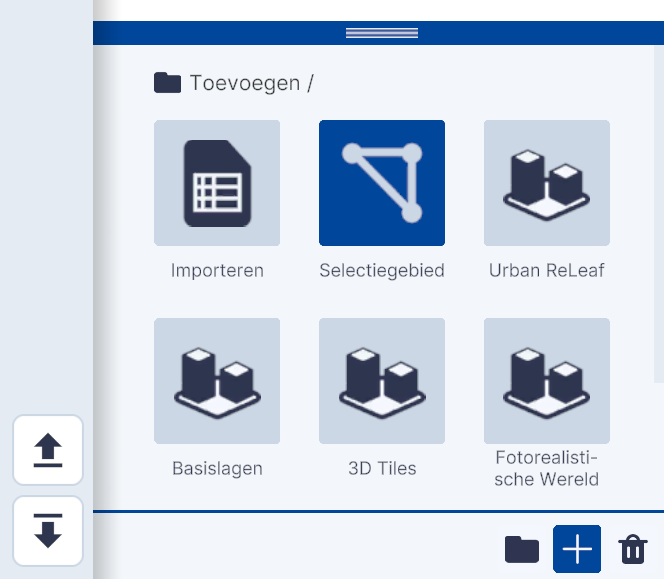
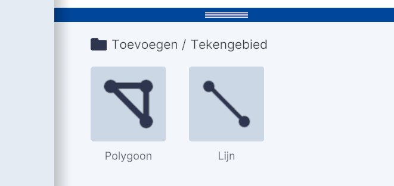
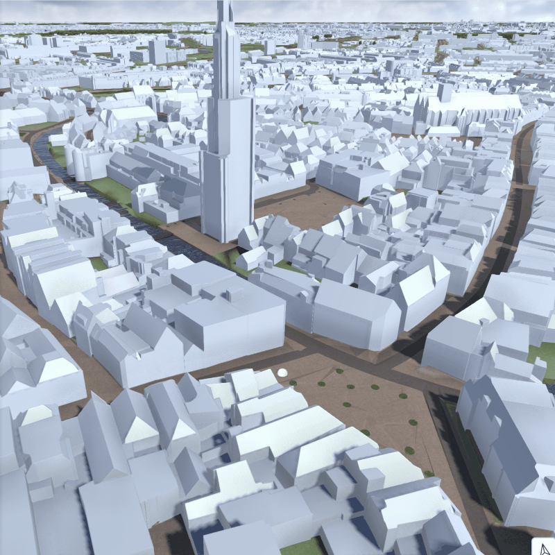
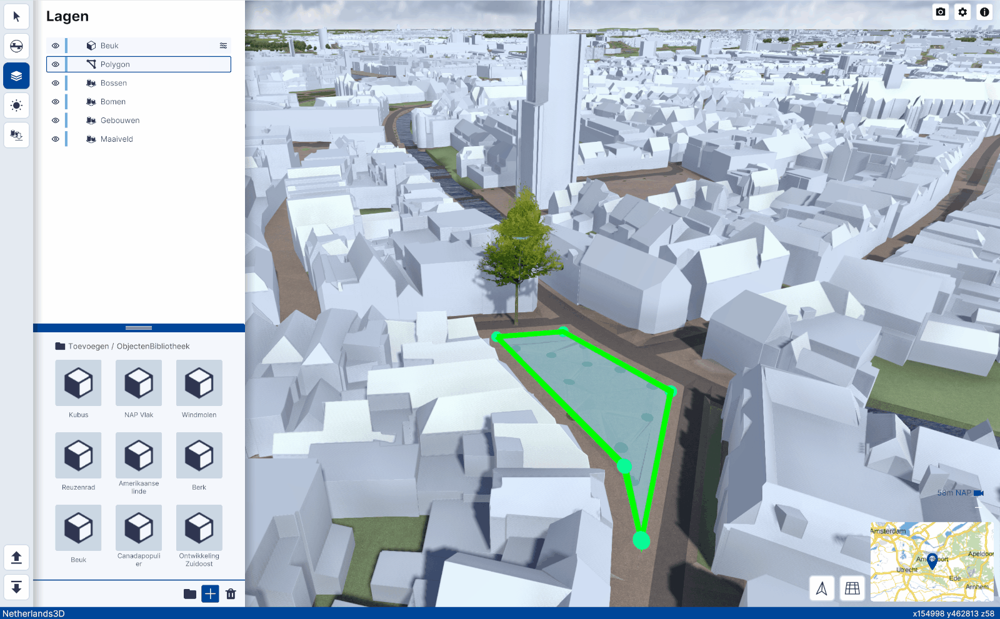
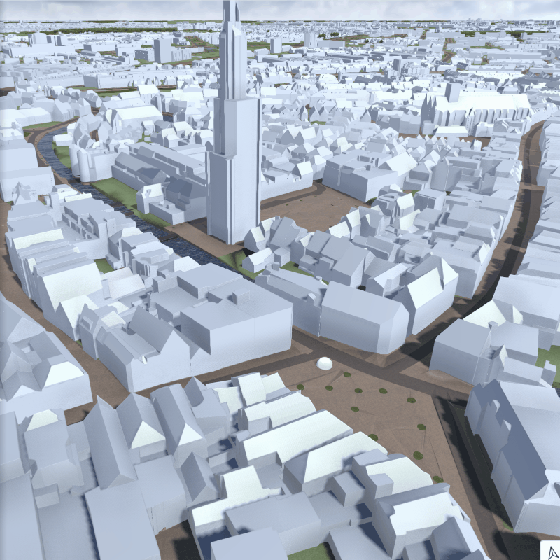
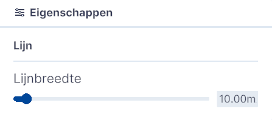

# Tekengebied

Functionaliteit, Lagen, submenu.  
  
{ width="350px" }  
Toevoegen / Tekengebied

## Gedetailleerde beschrijving van de functionaliteiten

Met deze functie is het mogelijk om één of meerdere Polygonen (veelvlakken) of lijnen in te tekenen.
   
{ width="350px" }  
 
###**Polygoon**   
Klik op Polygoon en een kleine witte bol verschijnt bij de muisaanwijzer in het 3D scherm. Klik en teken hiermee het volledige veelvlak of polygoon. Sluit het vlak door na het aanbrengen van meerdere punten op de laatste punt te klikken. Hierdoor wordt het vlak ingekleurd. [Kleuren aanpassen?] Door op een van de punten te klikken kan het vlak worden aangepast.  
 
{ width="350px" }  
Intekenen polygoon  
 
Er kunnen meerdere selectiegebieden worden ingetekend.  
 
###**Verspreid objecten in gebied**   
Door een object zoals bijvoorbeeld een boom uit de **Objectenbibliotheek** toe te voegen aan de laag Polygon, wordt de functie **Verspreid objecten in gebied** geactiveerd.    
 
  
Activeren functie **Verspreid objecten in gebied**.  
 
Doorloop de volgende stappen;  

- Voeg een object (boom) toe uit de **Objectenbibliotheek**  
- Sleep het object in **Lagen** op het Polygon  
- klik op eigenschappen van het object  
- vink **Verspreid objecten in gebied** aan  
- pas eventueel de Eigenschappen van Verspreiden object aan  
 
###**Lijn**  
Klik op Lijn en een kleine witte bol verschijnt bij de muisaanwijzer in het 3D scherm. Klik in het scherm en teken hiermee de lijn door het eindpunt op de gewenste plek te plaatsen. [Kleuren aanpassen?] Door op één van de eindpunten te klikken kan de lijn worden aangepast.  
 
{ width="350px" }  
Intekenen lijn  
 
De lijndikte kan worden aangepast door op het instellingen icoon te klikken. Het Eigenschappenmenu verschijnt waarmee de lijndikte van 1.00 tot 200.00 meter kan worden aangepast. Standaard is de dikte 10.00 meter.  
 
{ width="350px" }  
 
Er kunnen meerdere lijnen worden ingetekend.  