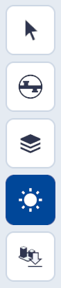
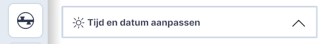
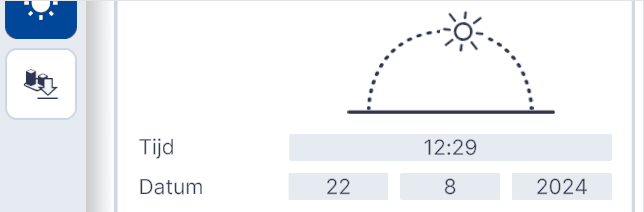
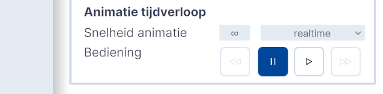
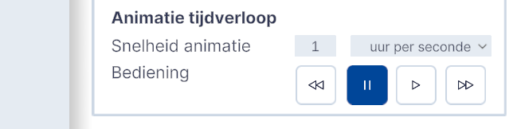

# Zonnestand

Functionaliteit, hoofdmenu.  
{ style="height:230px;width:50px" }

Zonnestand is een zon- en schaduw-simulatie tool die is ontwikkeld om gebruikers te helpen de impact van zonlicht en schaduwen in datalagen en ontwerpen op een specifieke locatie eenvoudig te visualiseren.  
Door gebruikers in staat te stellen basisparameters in te voeren, zoals tijd en datum, genereert Zonnestand real-time schaduwprojecties, waardoor het toegankelijk is voor data-specialisten, ontwerpers, docenten en hobbyisten. 
 

Dit hoofdstuk beschrijft de belangrijkste functionaliteiten van Zonnestand geeft uitleg over de interface en essentiële functies 

## Overzicht van functionaliteiten

Door het aanpassen van datum en tijd wordt de zonnestand realistisch weergegeven voor de gekozen locatie en het gekozen moment. Met animatie tijdverloop wordt het verloop van de schaduw gedurende de dag en nacht realistisch weergegeven. De snelheid van het verloop is instelbaar. 

<video controls>
<source src="../video/zonnestand.viewer.mp4" type="video/mp4">
</video>

## Gedetailleerde beschrijving van de functionaliteiten

### **Menu**

{ width="350px" }

### **Functionaliteiten**

* **Pull down**   
Door op de pijl [naar beneden] te klikken wordt het menu **Tijd en datum aanpassen** ingeklapt. Door vervolgens op de pijl [naar boven] te klikken klapt het menu **Tijd en datum aanpassen** uit.

{ width="350px" }
 
* **Tijd en Datum 1**   
[Handmatige invoer] vul het gewenste tijdstip bij  
	**Tijd** in [uur:minuut] en de gewenste datum bij  
	**Datum** in [dag:maand;jaaren] en druk op [enter].
	
{ width="350px" }

Het effect van de nieuwe zonnestand en bijbehorende schaduwval zijn direct zichtbaar.

* **Tijd en Datum 2**    
[Verslepen zon/maan-icoon] Door het icoon handmatig over de gestippelde boog te verslepen wordt de zonnestand en bijbehorend tijdstip aangepast. Zonnestand houdt hierbij automatisch rekening met zonsopgang en –ondergang. Zodra het tijdstip zich tussen zonsondergang en –opgang bevindt, verandert het icoon in een maan. 

{ width="350px" }

In het geval het tijdstip zich tussen zonsondergang en –opgang bevindt, is er geen schaduw zichtbaar.

* **Tijd en Datum (herstel)**  
[Herstel tijd en datum] Door op het icoon **Herstel tijd en datum** te klikken wordt de actuele datum en tijd van het computersysteem van de gebruiker overgenomen.

{ width="350px" }

* **Animatie tijdverloop realtime**   
[Pull down menu] Standaard staat de Snelheid animatie ingesteld op [realtime]. De pauze- en afspeelknop hebben geen functie.

{ width="350px" }

* **Animatie tijdverloop uur per seconde**   
Door in het pull down menu te kiezen voor [uur per seconde] kan de animatie van het verloop van de zon vanaf de ingestelde datum en tijdstip worden gestart met de [afspeelknop]. De andere knoppen van de interface worden dan ook actief.  
Met de [pauze knop] kan de animatie worden gestopt. Met de [forward] resp. [backward] knop kan de snelheid van de animatie met hele stappen van 1 uur per seconde worden versneld resp. Vertraagd.

{ width="350px" }

###  **Opslaan instellingen**

De instellingen van de functie Zonnestand zijn onderdeel van het Netherlands 3D bestand en worden opgeslagen met de functie Project Opslaan.

###  **Aanvullende technische details**

Zonnestand maakt gebruik van de engine ..... 