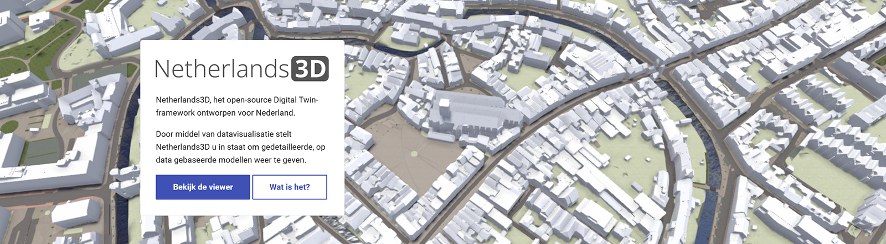
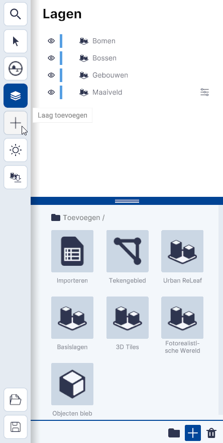

# Importeren van een 3D Tiles-link

Deze documentatie helpt je **stap voor stap** bij het **importeren van 3D Tiles** in Netherlands3D.
Houdt de link - dit is vaak een url - bij de hand.

---

## Stap 1. Open de 3D-Viewer

Ga naar [https://netherlands3d.eu](https://netherlands3d.eu/), klik op de knop `Bekijk de viewer` en de 3D-viewer wordt geopend.

/// caption
(Afbeelding) Homepage  
///

/// caption
(Afbeelding) 3D-Viewer startscherm; instellingen-menu
///

---

## Stap 2. Klik op de plus

{width="350px"}
/// caption
(Afbeelding) Basislagen & functionaliteiten
///
 
* Het lagen paneel klapt open en de **basislagen** (links boven) en de functies (links onder) worden zichtbaar.
* Het **Toevoegen-menu** en de verschillende **teken-, koppel- en importmogelijkheden** worden (gedeeltelijk) zichtbaar.

---

## Stap 3. Bestand toevoegen met url

{width="350px"}  
/// caption
(Afbeelding) Toevoegen / Importeren
///

Klik op <code>Importeren</code>. Het menu; <b>Toevoegen Importeren</b> wordt geopend.  
		

{width="350px"}
/// caption
(Afbeelding) Bestand via URL
///

Klik op `Bestand via URL`.  
Het menu **Laag toevoegen via URL** wordt geopend.  

{width="350px"}  
/// caption
(Afbeelding) Kopiëren en plakken van URL
///

Kopieër en plak de link van het bestand in het vakje [URL link] en klik op `Toevoegen`.

---

## Stap 4. Navigeer naar de 3D Tiles-data

Na `Toevoegen` is de link gekoppeld en is de laag zichtbaar in het `Lagen` paneel.

Ga naar de locatie waar de 3D Tiles-link betrekking op heeft om de 3D Tiles laag in de 3D-Viewer te bekijken.

Sla het project op met `Project Opslaan` (links onder) om de koppeling te bewaren.

!!! tip "Snel naar locatie van de data"
    Bij datasets die alleen een bepaalde locatie omvatten kan je ook dubbelklikken op de nieuwe laag. De camera verplaatst dan naar de locatie waar de data zich bevind.
