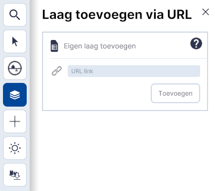

# Koppelen van een WMS/WFS-link 

Deze documentatie helpt je **stap voor stap** bij het **koppelen van een WMS/WFS-link** in Netherlands3D.eu.
Houdt de link - dit is vaak een url - bij de hand.

---

### **Instructie-video**

In onderstaande video wordt stap voor stap het toevoegen van een WMS/WFS-link uitgelegd.

<iframe width="1517" height="500" src="https://www.youtube.com/embed/FeUruvS2p1Q?si=ZLhhFdRZCGcpzEoO&amp;controls=0" title="YouTube video player" frameborder="0"  referrerpolicy="strict-origin-when-cross-origin" allowfullscreen></iframe>
_(Video) toevoegen WMS/WFS-link_

---

### **Stap 1. Start de 3D-Viewer functionaliteit**

Ga naar [Netherlands3d.eu](https://netherlands3d.eu/) en klik op `Bekijk de viewer` op de homepage en de 3D-viewer functionaliteit wordt gestart.

_(Afbeelding) Homepage_  
   
Sluit het **Instellingen-menu** door op `x`(rechtsboven) te klikken.

_(Afbeelding) 3D-Viewer startscherm; instellingen-menu_

---

### **Stap 2. Ga naar het Lagen-menu**

{ width="350px" align=left }  
<ul>
	<li>
		

		Klik vervolgens op <code>Lagen</code> in het hoofdmenu (3e icoon van boven) en activeer de tool.  
		

	</li>  
	<li>
		

		Het menu klapt open en de <b>basislagen</b> (links boven) en functionaliteiten (links onder) de worden zichtbaar.   
		 
		<i>(Afbeelding) Basislagen & functionaliteiten</i>
		

	</li>  
</ul>

---

### **Stap 3. Open het Toevoegen-menu**

{ width="350px" align=left }  
<ul>
	<li>
		

		Klik op <code>+</code> icoon en het <b>Toevoegen-menu</b> en de verschillende <b>teken-, koppel- en importmogelijkheden</b> worden (gedeeltelijk) zichtbaar.  
		<i>(Afbeelding) Toevoegen menu, volledig zichtbaar</i>
		

	</li>  
</ul>

---

### **Stap 4. Bestand toevoegen met url**

{ width="350px" align=left }  
<ul>
	<li>
		

		Klik op <code>Importeren</code>. Het menu; <b>Toevoegen Importeren</b> wordt geopend.   
		 
		<i>(Afbeelding) Toevoegen / Importeren</i>
		

	</li>  
</ul>

 

{ width="350px" align=left }  
<ul>
	<li>
		

		Klik op <code>Bestand via URL</code>.  
		Het menu; <b>Laag toevoegen via URL</b> wordt geopend.  
		  
		<i>(Afbeelding) Bestand via URL</i>
		

	</li>  
</ul>

 

{ width="350px" align=left }  
<ul>
	<li>
		

		Kopieër en plak de link van het bestand in het vakje [URL link] en klik op <code>Toevoegen</code>.
		  
		<i>(Afbeelding) Kopieëren en plakkken van url</i>
		

	</li>  
</ul>

---

###  **Stap 5. Navigeer naar de WMS/WFS-data**

Na `Toevoegen` is de link gekoppeld en zijn de sublagen (in het geval van een WFS) in Lagen zichtbaar.
Ga naar de locatie waar de de WMS/WFS-link betrekking op heeft om de WMS/WFS-Laag in de 3D-Viewer te bekijken.

Sla het project op met `Project Opslaan` (links onder) om de koppeling te bewaren.

---