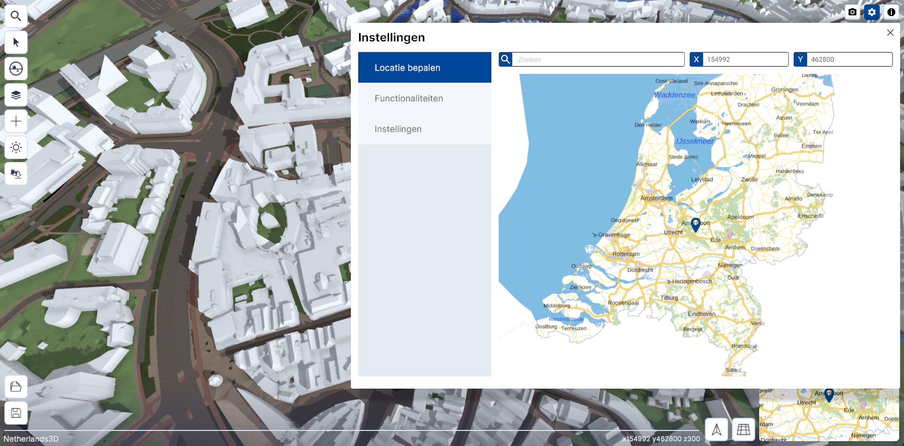
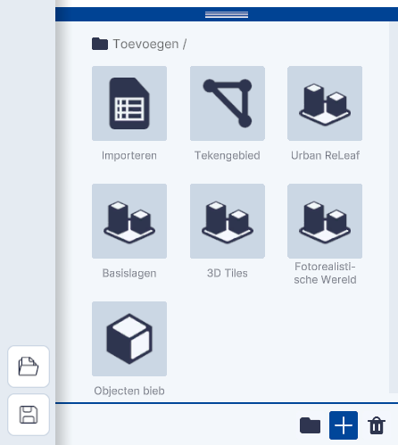
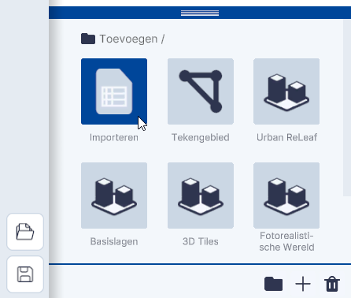

# Importeren van een WMS/WFS-link 

Deze documentatie helpt je **stap voor stap** bij het **koppelen van een WMS/WFS-link** in Netherlands3D.
Houdt de link - dit is vaak een url - bij de hand.

!!! info

    De link bevat meestal de term `?service=WFS&request=GetCapabilities` of `?service=WMS&request=GetCapabilities`. Is 
    dat niet het geval en je ontvangt een foutmelding bij het importeren? Probeer een van deze twee toe te voegen aan 
    je link.  

## **Instructie-video**

In onderstaande video wordt stap voor stap het toevoegen van een WMS/WFS-link uitgelegd.

<iframe width="1517" height="500" src="https://www.youtube.com/embed/FeUruvS2p1Q?si=ZLhhFdRZCGcpzEoO&amp;controls=0" title="YouTube video player" frameborder="0"  referrerpolicy="strict-origin-when-cross-origin" allowfullscreen></iframe>
/// caption
(Video) toevoegen WMS/WFS-link
///

---

## Stap 1. Open de 3D-Viewer

Ga naar [https://netherlands3d.eu](https://netherlands3d.eu/), klik op de knop `Bekijk de viewer` en de 
3D-viewer wordt geopend.

/// caption
(Afbeelding) Homepage  
///

/// caption
(Afbeelding) 3D-Viewer startscherm; instellingen-menu
///

---

## Stap 2. Ga naar het Lagen-menu

{width="350px"}
/// caption
(Afbeelding) Basislagen & functionaliteiten
///

* Klik op de `Lagen` knop in de werkbalk (3e icoon van boven).  
* Het lagen paneel klapt open en de **basislagen** (links boven) en functionaliteiten (links onder) worden zichtbaar.

---

## Stap 3. Open het Toevoegen-menu

{width="350px"}
/// caption
(Afbeelding) Toevoegen menu, volledig zichtbaar
///

Klik op `+` icoon en het **Toevoegen-menu** en de verschillende **teken-, koppel- en importmogelijkheden** worden 
(gedeeltelijk) zichtbaar.

---

## Stap 4. Bestand toevoegen met url

{width="350px"}  
/// caption
(Afbeelding) Toevoegen / Importeren
///

Klik op <code>Importeren</code>. Het menu; <b>Toevoegen Importeren</b> wordt geopend.  
		

{width="350px"}
/// caption
(Afbeelding) Bestand via URL
///

Klik op `Bestand via URL`.  
Het menu **Laag toevoegen via URL** wordt geopend.  

{width="350px"}  
/// caption
(Afbeelding) Kopiëren en plakken van URL
///

Kopieër en plak de link van het bestand in het vakje [URL link] en klik op `Toevoegen`.

---

## Stap 5. Navigeer naar de WMS/WFS-data

Na `Toevoegen` is de link gekoppeld en zijn de sublagen (in het geval van een WFS) in Lagen zichtbaar.
Ga naar de locatie waar de WMS/WFS-link betrekking op heeft om de WMS/WFS-Laag in de 3D-Viewer te bekijken.

Sla het project op met `Project Opslaan` (links onder) om de koppeling te bewaren.
