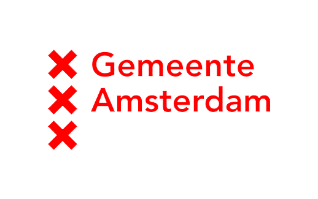
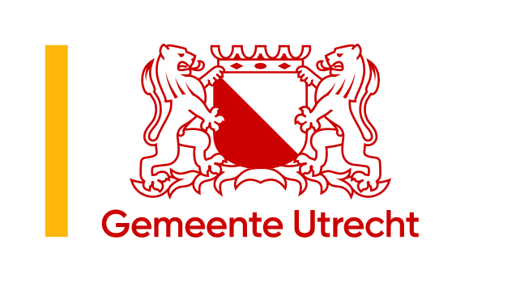
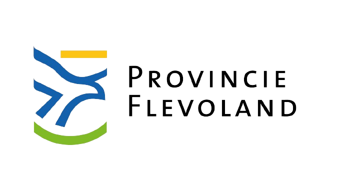

# Netherlands3D

Netherlands3D, het [open-source](https://github.com/Netherlands3D) Digital Twin-framework ontworpen voor Nederland. 

Door middel van datavisualisatie stelt Netherlands3D u in staat om gedetailleerde, op data gebaseerde modellen weer te 
geven.

[Bekijk de viewer](https://netherlands3d.eu/twin/){ .md-button .md-button--primary }
[Wat is het?](#wat-is-netherlands3d){ .md-button }

[//]: # (Dit is een uitgeschakelde include naar de uitgelicht sectie, verwijder de ; om dit te laten werken)
-8<- "; docs/_uitgelicht.md"

-8<- "docs/_wat-is-netherlands3d.md"

[//]: # (Dit is een uitgeschakelde include naar de nieuws sectie, verwijder de ; om dit te laten werken)
-8<- "; docs/_nieuws.md"

## In samenwerking met

- 
- 
- 
- 

